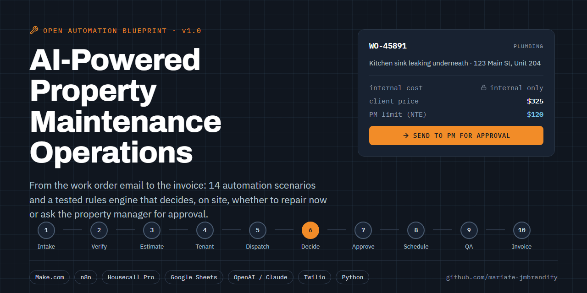
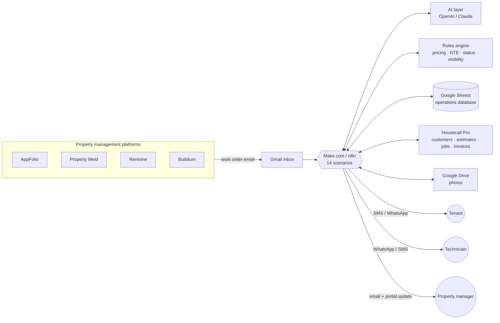
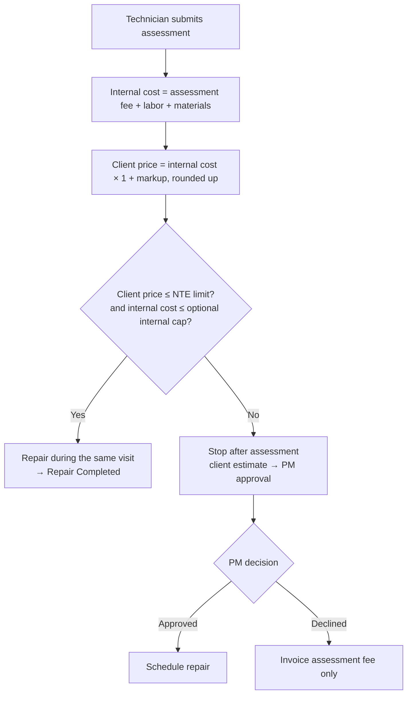

# AI-Powered Property Maintenance Operations Platform



> End-to-end automation for a maintenance vendor that serves property management companies: from the moment a work order email arrives to the invoice, the KPI dashboard, and the exceptions in between.

[](https://github.com/mariafe-jmbrandify/ai-property-maintenance-automation/actions/workflows/ci.yml)


```
PM Work Order → AI Intake → Initial Estimate → Tenant Confirmation → Assessment Visit
→ Budget Decision → PM Approval → Repair Scheduling → Completion & QA → Billing → Reporting
```

## The problem

Maintenance vendors that work for property managers juggle four systems and three audiences at once:

- Work orders arrive by email from **AppFolio, Property Meld, Rentvine, and Buildium**, each in a different format.
- Every job needs an **assessment first**, then a decision: fix it now, or ask the property manager to approve a price above their **not-to-exceed (NTE) limit**.
- **Tenants, property managers, and technicians** each need different information, and the PM must never see internal labor, material, or margin numbers.
- Approvals stall, tenants don't answer, parts are back-ordered, and nobody owns the next step.

This project designs the whole operation as 14 connected automation scenarios, with a tested rules engine for the parts that must never be left to an AI's judgment: pricing, approvals, status changes, and data visibility.

## What's in this repo

| Path | What it is |
|------|-----------|
| [`docs/architecture.md`](docs/architecture.md) | System diagram, integrations, status lifecycle, and audience views |
| [`docs/scenarios/`](docs/scenarios/README.md) | 14 scenario specs: trigger, modules, data writes, messages, test checklist |
| [`docs/business-rules.md`](docs/business-rules.md) | Every rule in one place: pricing, NTE decision, follow-ups, SLAs |
| [`docs/data-model.md`](docs/data-model.md) | Google Sheets operations database: 12 sheets, every column |
| [`docs/decisions/`](docs/decisions) | Architecture decision records (why it works this way) |
| [`docs/design-review.md`](docs/design-review.md) | What changed from the original design and why |
| [`prompts/`](prompts/README.md) | Production AI prompts and JSON schemas |
| [`config/`](config) | Business rules and the status lifecycle as YAML (single source of truth) |
| [`src/maintenance_ops/`](src/maintenance_ops) | Python rules engine, CLI demo, and a small HTTP API that Make.com calls |
| [`tests/`](tests) | 40 unit tests covering pricing, approvals, visibility, dispatch, SLAs, KPIs |
| [`data/sheets/`](data/sheets) | CSV templates for each Google Sheet, with synthetic sample rows |
| [`make/`](make/README.md) | Naming and export conventions for Make.com scenario blueprints |

## Architecture at a glance



**AI interprets, rules decide.** The AI reads emails, classifies trades, talks to tenants, checks completed work against scope, and writes reports. Prices, approval routing, and status changes come from deterministic rules in [`config/business_rules.yaml`](config/business_rules.yaml), implemented and tested in [`src/maintenance_ops`](src/maintenance_ops).

## The 14 scenarios

| # | Scenario | Ends in status |
|---|----------|----------------|
| 1 | [Work Order Intake & AI Extraction](docs/scenarios/01-work-order-intake.md) | New Work Order / Needs More Info |
| 2 | [Tenant Verification & PM Company Linking](docs/scenarios/02-tenant-verification.md) | Customer Verified |
| 3 | [Initial Assessment Estimate & Internal Review](docs/scenarios/03-initial-estimate.md) | Awaiting Tenant Confirmation |
| 4 | [Tenant Confirmation & Discovery](docs/scenarios/04-tenant-confirmation.md) | Ready for Assessment Dispatch |
| 5 | [Assessment Dispatch](docs/scenarios/05-assessment-dispatch.md) | Assessment Scheduled |
| 6 | [Assessment, Pricing & Budget Decision](docs/scenarios/06-assessment-budget-decision.md) | Repair Completed / Pending PM Approval |
| 7 | [PM Approval & Owner Authorization](docs/scenarios/07-pm-approval.md) | Repair Approved / Estimate Declined |
| 8 | [Repair Scheduling & Dispatch](docs/scenarios/08-repair-scheduling.md) | Repair Scheduled |
| 9 | [Completion, QA & Tenant Sign-off](docs/scenarios/09-completion-qa.md) | Ready for Invoice / Callback Required |
| 10 | [Billing, Technician Pay & Reconciliation](docs/scenarios/10-billing-reconciliation.md) | Invoiced → Closed |
| 11 | [KPI Dashboard & Management Reporting](docs/scenarios/11-kpi-dashboard.md) | — |
| 12 | [Exception Handling & Escalation](docs/scenarios/12-exception-handling.md) | Hold states → back to flow |
| 13 | [AI Operations Coordinator](docs/scenarios/13-ai-operations-coordinator.md) | — |
| 14 | [AI Knowledge Base & SOP Assistant](docs/scenarios/14-ai-knowledge-base.md) | — |

## The core decision: fix now, or ask for approval?



Worked example (default rules: 35% markup, round up to $5):

| | Same-visit repair | Approval required |
|---|---|---|
| Assessment fee + labor + materials (internal) | $75 + $60 + $25 = **$160** | $75 + $120 + $45 = **$240** |
| Client price | $160 × 1.35 = $216 → **$220** | $240 × 1.35 = $324 → **$325** |
| PM's NTE limit | $250 | $120 |
| Decision | Repair now | Send $325 estimate for approval |
| Invoice if approved | $220 | $325 (assessment fee credited, not billed) |
| Gross profit | $60 | $85 |

The property manager sees the scope, photos, and the client price. They never see the $240.

## Quick start

```bash
git clone https://github.com/mariafe-jmbrandify/ai-property-maintenance-automation.git
cd ai-property-maintenance-automation
pip install -e ".[dev]"

pytest -q                                  # 40 tests
python -m maintenance_ops.cli demo         # run three sample assessments end to end
python -m maintenance_ops.cli decide --labor 120 --materials 45 --nte 120
python -m maintenance_ops.server --port 8080  # HTTP API used by Scenarios 1 and 6
```

To build the automation itself:

1. Create a Google Sheet named **AI Maintenance Operations Database** and import each CSV from [`data/sheets/`](data/sheets) as its own tab.
2. Copy `.env.example` to `.env` and collect the credentials it lists, then add them as Make.com connections.
3. Build the scenarios in order, starting with [Scenario 1](docs/scenarios/01-work-order-intake.md). Each spec ends with a test checklist; don't start the next scenario until it passes.

## Tech stack

| Layer | Tools |
|-------|-------|
| Work order sources | AppFolio, Property Meld, Rentvine, Buildium |
| Orchestration | Make.com (primary), n8n (alternative) |
| AI | OpenAI or Anthropic Claude, structured JSON output |
| Field service CRM | Housecall Pro (customers, estimates, jobs, invoices) |
| Operations database | Google Sheets |
| Messaging | Twilio SMS, WhatsApp Cloud API, Gmail |
| Files | Google Drive |
| Rules engine | Python 3.10+, PyYAML, pytest |
| Optional | GoHighLevel for tenant communication history, Playwright for PM portals without an API |

## Project status

| Area | Status |
|------|--------|
| Scenario specifications (1–14) | ✅ Complete |
| Business rules + status lifecycle | ✅ Complete, versioned in `config/` |
| Rules engine + tests | ✅ Complete |
| Google Sheets templates | ✅ Complete (synthetic data) |
| AI prompts + schemas | ✅ Complete |
| Make.com blueprint exports | 🔜 Added to `make/blueprints/` as each scenario is built and tested |

## Data and privacy

All names, addresses, phone numbers, and companies in this repository are fictional. Do not commit real client exports; `data/private/` and `.env` are git-ignored.

## License

[MIT](LICENSE) © 2026 Maria Fe Blanca
