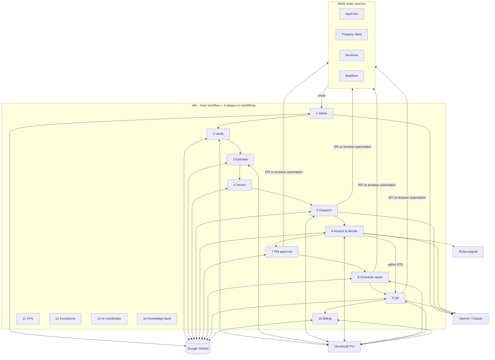
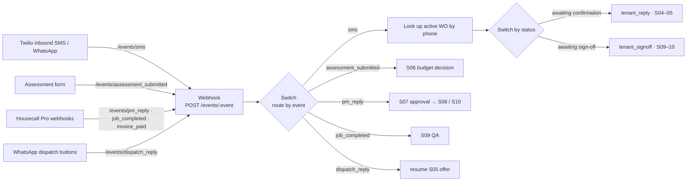
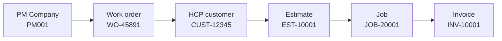
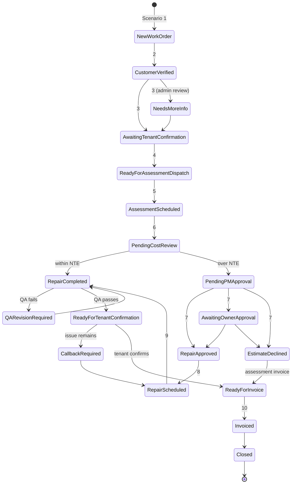

# Architecture

## Goals

1. Every work order moves forward automatically until a human decision is actually needed.
2. Every work order always has a **status**, a **next action**, an **owner**, and a **due time**.
3. The PM Work Order # follows the job from intake to invoice.
4. Property managers, technicians, and the internal team each see only what they should.
5. Money and approvals follow written rules, not AI judgment.

## System context

## Orchestration in n8n

Decision record: [ADR-004](decisions/ADR-004-n8n-orchestrator.md).

| Workflow | Triggers | Scenarios |
|----------|----------|-----------|
| `Maintenance Ops · Work Order Lifecycle` (main) | Gmail Trigger (new work orders), Webhook `POST /events/:event`, Gmail Trigger (approval replies) | 1–10 |
| `Maintenance Ops · Exception Monitor` | Schedule Trigger every 10 min + daily 08:00 | 12 (and 7/10 follow-up timers) |
| `Maintenance Ops · KPI Report` | Schedule Trigger daily 06:00, Monday 07:00 | 11 |
| `Maintenance Ops · Coordinator` | Schedule Trigger + Slack Trigger | 13 |
| `Maintenance Ops · SOP Assistant` | Chat Trigger | 14 |

### Event router

Everything that happens *after* intake arrives as an event on one webhook. The Switch node sends it to its branch; the branch loads the work order from Google Sheets, acts, and writes the new status back. No execution sits waiting for days, so every branch is short, easy to debug and safe to re-run.

| Event | Sent by | Branch |
|-------|---------|--------|
| `sms` | Twilio inbound webhook (tenant texts) | Resolved by work order status → `tenant_reply` or `tenant_signoff` |
| `dispatch_reply` | WhatsApp quick-reply buttons | Resumes the waiting dispatch offer (Scenario 5) |
| `assessment_submitted` | Technician assessment form | Scenario 6 |
| `pm_reply` | Housecall Pro estimate approved / declined (email replies use a second Gmail Trigger into the same branch) | Scenario 7 |
| `job_completed` | Housecall Pro job completed or the completion form | Scenario 9 |
| `invoice_paid` | Housecall Pro invoice paid | Scenario 10 payment status |

Short in-run waits (a technician accepting within 15 minutes, a reviewer clicking Approve) use a **Wait** node set to *On Webhook Call*. Anything measured in hours or days (approvals, tenant replies, payments) is handled by the Exception Monitor reading timestamps from the sheet.

The rules engine (`python -m maintenance_ops.server`) is called with **HTTP Request** nodes (`/decide`, `/extraction`). Without it, the same formulas fit in **Code** nodes; keep them in sync with `config/business_rules.yaml`.

## Systems and their jobs

| System | Role | System of record for |
|--------|------|----------------------|
| PM platforms | Source of work orders; receive status updates | PM Work Order #, NTE limit, PM-side status |
| Gmail | Intake inbox, PM notifications | Original work order email |
| n8n | Orchestration: triggers, event routing, AI agents, retries | Execution history |
| AI (OpenAI / Claude) | Extraction, classification, tenant conversation, QA review, narrative reports | Nothing (stateless) |
| Rules engine | Pricing, NTE decision, status guard, visibility filters, SLA timers | Business rules (`config/`) |
| Google Sheets | Operations database and dashboard source | Status, timestamps, next action, KPIs |
| Housecall Pro | Field service CRM | Customers, estimates, jobs, invoices, schedule |
| Google Drive | Photo and document storage | Before / during / after photos |
| Twilio / WhatsApp | Tenant and technician messaging | Message delivery |

**Why Google Sheets in the middle?** See [ADR-003](decisions/ADR-003-google-sheets-operations-db.md). In short: every scenario can trigger on a status change, the team can see and correct data without new software, and it is easy to migrate to Airtable or Postgres later because the schema is documented in [data-model.md](data-model.md).

## The record that follows the job

- `record_id` (e.g. `MO-2026-0001`) is our internal key. It prevents collisions when two PM companies use the same work order number.
- `pm_work_order_number` appears in the estimate title, on every PM message, and on the invoice.
- PM company details live in **dedicated fields**, never in free-text notes, so billing and approvals can route on them.

## Status lifecycle

The full list and allowed transitions live in [`config/status_lifecycle.yaml`](../config/status_lifecycle.yaml). Scenarios trigger on these exact strings.

Hold states from Scenario 12 (`Waiting Tenant Response`, `Access Failed`, `Waiting Parts`, `Approval Delayed`, `Cancelled`) can interrupt the flow and return to it.

Every status change appends a row to the **Status History** sheet. KPIs such as approval time and response time are calculated from that history, not from overwritten cells.

## Audience views

| Data | PM company | Technician | Internal |
|------|:---:|:---:|:---:|
| PM Work Order #, PM company | ✅ | ❌ | ✅ |
| Estimate #, Job #, Invoice # | ✅ | ✅ (estimate/job) | ✅ |
| Address, unit, tenant name | ✅ | ✅ | ✅ |
| Tenant phone, entry instructions, pets | ❌ | ✅ | ✅ |
| Findings, scope of work, photos | ✅ | ✅ | ✅ |
| Client price / invoice total | ✅ | ❌ | ✅ |
| Assessment fee cost, labor, materials, markup, margin, technician pay | ❌ | ❌ | ✅ |

Implemented in [`visibility.py`](../src/maintenance_ops/visibility.py). Any outbound PM or technician message should pass `leaked_fields(payload) == []` before sending.

## Failure handling principles

- **Validate before write.** AI output is parsed against a JSON schema and validated before it reaches the database.
- **Idempotency.** Scenario 1 checks for an existing `pm_work_order_number` + `pm_company_id` before creating a row, so a re-sent email does not create a duplicate job.
- **Error routes.** Every n8n node that calls an external API uses **On Error → Continue (using error output)**, wired to a node that logs to the Exceptions sheet and alerts Operations, and the workflows share an **Error Workflow**; nothing fails silently.
- **Human in the loop.** Missing data, failed QA, declined estimates, and anything the AI is unsure about route to a person with a clear next action.
