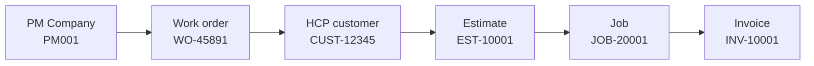
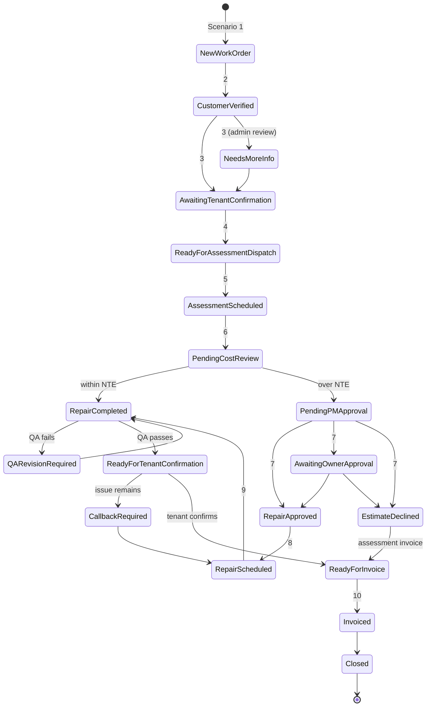

# Architecture

## Goals

1. Every work order moves forward automatically until a human decision is actually needed.
2. Every work order always has a **status**, a **next action**, an **owner**, and a **due time**.
3. The PM Work Order # follows the job from intake to invoice.
4. Property managers, technicians, and the internal team each see only what they should.
5. Money and approvals follow written rules, not AI judgment.

## System context

## Systems and their jobs

| System | Role | System of record for |
|--------|------|----------------------|
| PM platforms | Source of work orders; receive status updates | PM Work Order #, NTE limit, PM-side status |
| Gmail | Intake inbox, PM notifications | Original work order email |
| Make.com / n8n | Orchestration, timers, routing | Scenario run history |
| AI (OpenAI / Claude) | Extraction, classification, tenant conversation, QA review, narrative reports | Nothing (stateless) |
| Rules engine | Pricing, NTE decision, status guard, visibility filters, SLA timers | Business rules (`config/`) |
| Google Sheets | Operations database and dashboard source | Status, timestamps, next action, KPIs |
| Housecall Pro | Field service CRM | Customers, estimates, jobs, invoices, schedule |
| Google Drive | Photo and document storage | Before / during / after photos |
| Twilio / WhatsApp | Tenant and technician messaging | Message delivery |

**Why Google Sheets in the middle?** See [ADR-003](decisions/ADR-003-google-sheets-operations-db.md). In short: every scenario can trigger on a status change, the team can see and correct data without new software, and it is easy to migrate to Airtable or Postgres later because the schema is documented in [data-model.md](data-model.md).

## The record that follows the job

- `record_id` (e.g. `MO-2026-0001`) is our internal key. It prevents collisions when two PM companies use the same work order number.
- `pm_work_order_number` appears in the estimate title, on every PM message, and on the invoice.
- PM company details live in **dedicated fields**, never in free-text notes, so billing and approvals can route on them.

## Status lifecycle

The full list and allowed transitions live in [`config/status_lifecycle.yaml`](../config/status_lifecycle.yaml). Scenarios trigger on these exact strings.

Hold states from Scenario 12 (`Waiting Tenant Response`, `Access Failed`, `Waiting Parts`, `Approval Delayed`, `Cancelled`) can interrupt the flow and return to it.

Every status change appends a row to the **Status History** sheet. KPIs such as approval time and response time are calculated from that history, not from overwritten cells.

## Audience views

| Data | PM company | Technician | Internal |
|------|:---:|:---:|:---:|
| PM Work Order #, PM company | ✅ | ❌ | ✅ |
| Estimate #, Job #, Invoice # | ✅ | ✅ (estimate/job) | ✅ |
| Address, unit, tenant name | ✅ | ✅ | ✅ |
| Tenant phone, entry instructions, pets | ❌ | ✅ | ✅ |
| Findings, scope of work, photos | ✅ | ✅ | ✅ |
| Client price / invoice total | ✅ | ❌ | ✅ |
| Assessment fee cost, labor, materials, markup, margin, technician pay | ❌ | ❌ | ✅ |

Implemented in [`visibility.py`](../src/maintenance_ops/visibility.py). Any outbound PM or technician message should pass `leaked_fields(payload) == []` before sending.

## Failure handling principles

- **Validate before write.** AI output is parsed against a JSON schema and validated before it reaches the database.
- **Idempotency.** Scenario 1 checks for an existing `pm_work_order_number` + `pm_company_id` before creating a row, so a re-sent email does not create a duplicate job.
- **Error routes.** Every Make.com module that calls an external API has an error handler that logs to the Exceptions sheet and alerts Operations; nothing fails silently.
- **Human in the loop.** Missing data, failed QA, declined estimates, and anything the AI is unsure about route to a person with a clear next action.
