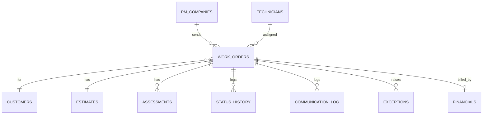

# Data Model: Google Sheets Operations Database

Workbook name: **AI Maintenance Operations Database**. Import each CSV in [`data/sheets/`](../data/sheets) as a tab with the same name (without the number prefix).

Conventions:

- `snake_case` headers so n8n expressions (`{{ $json.status }}`) map fields reliably.
- Timestamps in `YYYY-MM-DD HH:MM`, in the company's local time zone.
- Money as plain numbers (`325`, not `$325.00`).
- Columns marked **INTERNAL** must never be mapped into PM- or technician-facing messages.
- Protect the Financials and Assessments tabs so only Operations and Accounting can edit them.

## Work Orders

Master record. One row per work order; every scenario reads and writes it. Written by scenario(s): 1–13. Template: [`01_work_orders.csv`](../data/sheets/01_work_orders.csv)

| Column | Description |
|---|---|
| `record_id` | Internal key, `MO-YYYY-NNNN`. Unique across PM companies. |
| `pm_work_order_number` | Work order # from the PM platform. Appears on estimate, PM messages, invoice. |
| `source_platform` | AppFolio, Property Meld, Rentvine, Buildium, Other. |
| `pm_company_id` | Foreign key to PM Companies. |
| `pm_company_name` | Denormalized for readability. |
| `received_at` | When the work order email arrived. |
| `status` | Canonical status from `config/status_lifecycle.yaml`. |
| `priority` | Emergency, High, Normal, Low. |
| `trade` | Plumbing, Electrical, HVAC, … (see config). |
| `nte_limit` | Not-to-exceed amount from the work order. Falls back to the PM company default. |
| `property_address` | Service address. |
| `unit` | Unit number, if any. |
| `tenant_name` | Tenant / resident. |
| `tenant_phone` | Normalized `(555) 111-1111`. |
| `tenant_email` | Tenant email. |
| `issue_description` | Issue as reported, updated by tenant discovery. |
| `entry_instructions` | Gate/lockbox codes, call-ahead notes. |
| `pet_notes` | Pets on site. |
| `photos_folder_url` | Google Drive folder for this work order. |
| `hcp_customer_id` | Housecall Pro customer ID. |
| `estimate_id` | Housecall Pro estimate ID. |
| `estimate_title` | Standard title (EST-2). |
| `job_id` | Housecall Pro job ID. |
| `invoice_id` | Housecall Pro invoice ID. |
| `tenant_contacted_at` | Last outbound tenant message (drives follow-up timers). |
| `first_tenant_contact_at` | First outbound tenant message (SLA). |
| `tenant_confirmed` | Yes / No. |
| `preferred_windows` | Tenant availability windows. |
| `assessment_technician` | Who did the assessment. |
| `assessment_scheduled_at` | Assessment appointment start. |
| `assessment_submitted_at` | When the assessment form arrived. |
| `internal_cost_total` | INTERNAL. Fee + labor + materials. |
| `client_price` | Client-facing price after markup. |
| `decision` | `WITHIN_LIMIT` or `APPROVAL_REQUIRED`. |
| `approval_requested_at` | Estimate sent to PM. |
| `approval_received_at` | PM decision received. |
| `approved_by` | Name/email of approver. |
| `repair_technician` | Who does the repair. |
| `repair_scheduled_at` | Repair appointment start. |
| `repair_completed_at` | Repair completion time. |
| `first_visit_resolution` | Yes if fixed during the assessment visit. |
| `qa_status` | Pending, Passed, Revision Required. |
| `tenant_signoff` | Tenant confirmed the fix. |
| `callback_required` | Yes if the issue remained. |
| `closed_at` | Work order closed. |
| `next_action` | What must happen next (Scenario 13 keeps this current). |
| `next_action_owner` | Dispatcher, Operations, Accounting, Technician. |
| `next_action_due` | Deadline for the next action. |
| `last_updated_at` | Last write by any scenario. |

## PM Companies

Billing and approval directory. Drives NTE defaults, approval routing, invoice delivery. Written by scenario(s): 2, 7, 10, 14. Template: [`02_pm_companies.csv`](../data/sheets/02_pm_companies.csv)

| Column | Description |
|---|---|
| `pm_company_id` | Foreign key to PM Companies. |
| `pm_company_name` | Denormalized for readability. |
| `platform` | PM platform this company uses. |
| `billing_email` | Where invoices go. |
| `approval_email` | Where estimates go for approval. |
| `approval_contact_name` | Approver name. |
| `owner_approval_threshold` | Above this client price the PM needs owner approval. |
| `billing_address` | For invoices. |
| `payment_terms` | Net 15, Net 30 … |
| `default_nte_limit` | NTE when the work order has none. |
| `preferred_channel` | Email or portal for updates. |
| `required_photos` | PM-specific photo requirements. |
| `invoice_format_notes` | PM-specific invoice requirements. |
| `portal_update_method` | API or Browser automation. |
| `active` | Yes / No. |

## Customers

Mirror of Housecall Pro customers for fast lookup. Written by scenario(s): 2. Template: [`03_customers.csv`](../data/sheets/03_customers.csv)

| Column | Description |
|---|---|
| `hcp_customer_id` | Housecall Pro customer ID. |
| `tenant_name` | Tenant / resident. |
| `phone` | Phone. |
| `email` | Email. |
| `service_address` | Address on the HCP customer. |
| `unit` | Unit number, if any. |
| `pm_company_id` | Foreign key to PM Companies. |
| `created_at` | Created. |

## Estimates

One row per estimate; updated in place after assessment. Written by scenario(s): 3, 6, 7. Template: [`04_estimates.csv`](../data/sheets/04_estimates.csv)

| Column | Description |
|---|---|
| `estimate_id` | Housecall Pro estimate ID. |
| `record_id` | Internal key, `MO-YYYY-NNNN`. Unique across PM companies. |
| `pm_work_order_number` | Work order # from the PM platform. Appears on estimate, PM messages, invoice. |
| `estimate_title` | Standard title (EST-2). |
| `estimate_type` | Initial Assessment (always; updated in place). |
| `status` | Canonical status from `config/status_lifecycle.yaml`. |
| `client_price` | Client-facing price after markup. |
| `internal_cost_total` | INTERNAL. Fee + labor + materials. |
| `approval_required` | Yes / No. |
| `approval_status` | Pending, Approved, Declined. |
| `created_at` | Created. |
| `updated_at` | Last updated. |

## Assessments

Technician assessment submissions. Contains internal costs. Written by scenario(s): 6. Template: [`05_assessments.csv`](../data/sheets/05_assessments.csv)

| Column | Description |
|---|---|
| `record_id` | Internal key, `MO-YYYY-NNNN`. Unique across PM companies. |
| `estimate_id` | Housecall Pro estimate ID. |
| `technician` | Technician name. |
| `visit_date` | Assessment date. |
| `findings` | What the technician found. |
| `troubleshooting` | Steps performed. |
| `root_cause` | Cause of the issue. |
| `recommendation` | Recommended repair. |
| `scope_of_work` | Itemized scope. |
| `assessment_fee_cost` | INTERNAL. Cost of the visit. |
| `labor_cost` | INTERNAL. |
| `material_cost` | INTERNAL. |
| `internal_cost_total` | INTERNAL. Fee + labor + materials. |
| `markup_pct` | INTERNAL. Markup used. |
| `client_price` | Client-facing price after markup. |
| `photos_url` | Drive folder or links. |
| `repair_completed_onsite` | Yes if completed during assessment. |
| `technician_remarks` | Free text. |

## Technicians

Roster used for dispatch matching. Written by scenario(s): 5, 8, 11. Template: [`06_technicians.csv`](../data/sheets/06_technicians.csv)

| Column | Description |
|---|---|
| `technician_id` | Key. |
| `name` | Name. |
| `phone` | Phone. |
| `trades` | Comma-separated trades. |
| `skills` | Specialties. |
| `service_areas` | Comma-separated areas. |
| `available_days` | Comma-separated days. |
| `status` | Canonical status from `config/status_lifecycle.yaml`. |
| `current_jobs` | Jobs assigned today. |
| `max_daily_jobs` | Capacity. |
| `rating` | Average tenant rating. |
| `whatsapp_opt_in` | Can receive WhatsApp dispatch. |
| `calendar_id` | Calendar to check. |
| `active` | Yes / No. |

## Status History

Append-only log of every status change. Source for time-based KPIs. Written by scenario(s): All. Template: [`07_status_history.csv`](../data/sheets/07_status_history.csv)

| Column | Description |
|---|---|
| `record_id` | Internal key, `MO-YYYY-NNNN`. Unique across PM companies. |
| `from_status` | Previous status. |
| `to_status` | New status. |
| `changed_at` | Timestamp. |
| `changed_by` | Scenario or person. |
| `scenario` | Scenario number. |

## Communication Log

Every message to tenants, PMs, and technicians. Written by scenario(s): 4, 5, 7, 8, 9, 12. Template: [`08_communication_log.csv`](../data/sheets/08_communication_log.csv)

| Column | Description |
|---|---|
| `log_id` | Key. |
| `record_id` | Internal key, `MO-YYYY-NNNN`. Unique across PM companies. |
| `timestamp` | When. |
| `channel` | SMS, WhatsApp, Email, Call. |
| `direction` | Inbound / Outbound. |
| `audience` | Tenant, PM, Technician, Internal. |
| `template` | Message template ID. |
| `summary` | One-line summary. |
| `delivery_status` | Delivered, Failed … |

## Financials

Invoices, credits, technician pay, profit. Internal only. Written by scenario(s): 10, 11. Template: [`09_financials.csv`](../data/sheets/09_financials.csv)

| Column | Description |
|---|---|
| `invoice_id` | Housecall Pro invoice ID. |
| `record_id` | Internal key, `MO-YYYY-NNNN`. Unique across PM companies. |
| `pm_work_order_number` | Work order # from the PM platform. Appears on estimate, PM messages, invoice. |
| `pm_company_id` | Foreign key to PM Companies. |
| `invoice_type` | `repair` or `assessment_only`. |
| `invoice_total` | Client-facing total. |
| `assessment_credit_applied` | Waived or Deducted. |
| `technician_cost` | INTERNAL. |
| `gross_profit` | INTERNAL. |
| `gross_margin_pct` | INTERNAL. |
| `technician_payment_status` | INTERNAL. Pending / Paid. |
| `sent_at` | Invoice sent. |
| `payment_status` | Sent, Viewed, Pending Payment, Paid, Overdue. |
| `paid_at` | Paid date. |
| `days_outstanding` | Formula. |

## Exceptions

Open exceptions with owner and deadline. Written by scenario(s): 12, 13. Template: [`10_exceptions.csv`](../data/sheets/10_exceptions.csv)

| Column | Description |
|---|---|
| `exception_id` | Key. |
| `record_id` | Internal key, `MO-YYYY-NNNN`. Unique across PM companies. |
| `type` | Exception type (Scenario 12). |
| `detected_at` | When detected. |
| `owner` | Responsible team. |
| `status` | Canonical status from `config/status_lifecycle.yaml`. |
| `next_action` | What must happen next (Scenario 13 keeps this current). |
| `due_at` | Deadline. |
| `resolution` | How it was resolved. |
| `resolved_at` | When resolved. |

## SOP Library

Knowledge base index. Written by scenario(s): 14. Template: [`11_sop_library.csv`](../data/sheets/11_sop_library.csv)

| Column | Description |
|---|---|
| `sop_id` | Key. |
| `sop_name` | Name. |
| `category` | Operations, Field, Billing … |
| `audience` | Tenant, PM, Technician, Internal. |
| `instructions_url` | Link to the SOP document. |
| `version` | Version. |
| `updated_at` | Last updated. |

## Troubleshooting Library

Diagnosis guides for the technician assistant. Written by scenario(s): 14. Template: [`12_troubleshooting_library.csv`](../data/sheets/12_troubleshooting_library.csv)

| Column | Description |
|---|---|
| `issue` | Problem. |
| `trade` | Plumbing, Electrical, HVAC, … (see config). |
| `symptoms` | What the tenant reports. |
| `diagnosis_steps` | Checks in order. |
| `common_fix` | Usual repair. |
| `required_photos` | PM-specific photo requirements. |

## Dashboard tabs (Scenario 11)

Built with formulas or pivot tables over the sheets above; no manual entry:

- **Work Order KPIs**: volume, open backlog, response time, approval time, completion time by week.
- **Technician KPIs**: jobs completed, first-visit resolution, callback rate, QA pass rate, rating.
- **Financial KPIs**: revenue, internal cost, gross profit and margin, outstanding invoices by age.
- **PM Company KPIs**: jobs, revenue, average repair price, average approval time, days to pay.
