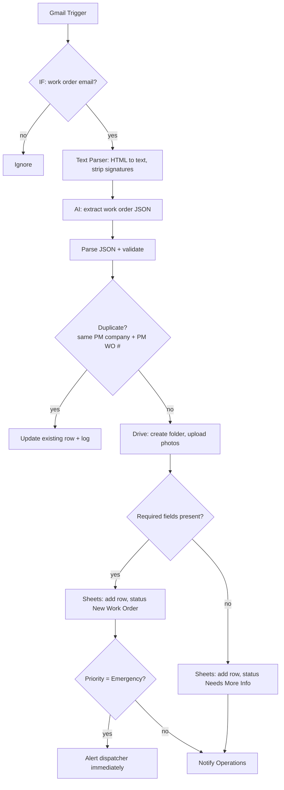

# Scenario 1 — Work Order Intake & AI Extraction

| | |
|---|---|
| **n8n workflow** | `Maintenance Ops · Work Order Lifecycle` → intake branch (nodes prefixed `S01`) |
| **Trigger** | **Gmail Trigger** on the maintenance inbox |
| **Exit status** | `New Work Order` (complete) or `Needs More Info` (missing data) |
| **Systems** | Gmail, OpenAI / Claude, Google Drive, Google Sheets |
| **Rules** | WO-1, WO-3, WO-4 |

## Objective

Receive maintenance requests from AppFolio, Property Meld, Rentvine, and Buildium, extract the work order details with AI, store the photos, and create one clean record in the Work Orders sheet. Every later scenario depends on this data, so nothing incomplete moves forward.

## Flow



## Before you build

Create the spreadsheet **AI Maintenance Operations Database** with the tabs from [`data/sheets/`](../../data/sheets) (at minimum `work_orders`, `pm_companies`, `status_history`, `exceptions`).

## n8n nodes

| # | Node | Configuration |
|---|------|---------------|
| 1 | **Gmail Trigger** | Poll every minute. Filters: label `Work Orders` (applied by a Gmail filter) or query `subject:(work order OR maintenance OR "repair request")`. Download attachments: on. |
| 2 | **IF** · work order email? | Subject matches the patterns above **or** sender domain is in the PM Companies sheet (looked up once per run with a **Google Sheets → Get Rows** node before this IF). |
| 3 | **Code** · clean email | Strip HTML, signatures and confidentiality footers; keep the first 6,000 characters. |
| 4 | **AI Agent** · Intake Agent | System prompt: [`prompts/01-work-order-extraction.md`](../../prompts/01-work-order-extraction.md). Sub-nodes: **OpenAI Chat Model** (or **Anthropic Chat Model**, temperature 0), **Simple Memory** (not required for one-shot extraction, useful when Ops replies with corrections), **Structured Output Parser** using [`work_order.schema.json`](../../prompts/schemas/work_order.schema.json). |
| 5 | **HTTP Request** · validate | `POST {{RULES_ENGINE_URL}}/extraction` with the agent output. Returns normalized data, `missing`, `next_status`. (No rules engine? Use an IF on the required fields.) |
| 6 | **Google Sheets → Get Row(s)** · duplicate check | `work_orders` where `pm_work_order_number` and `pm_company_name` match. Found → **Google Sheets → Update Row** and stop. |
| 7 | **IF** · valid? | `next_status` = `New Work Order`. False → **Gmail → Send** to Ops with the missing fields, and append the row as `Needs More Info`. |
| 8 | **Google Drive → Upload** | One file per attachment into `Maintenance Photos/{record_id} {pm_work_order_number}` (create the folder first with **Google Drive → Create Folder**). |
| 9 | **Google Sheets → Append Row** | `work_orders`, mapping below; then append to `status_history`. |
| 10 | **IF** · emergency? | `priority` = `Emergency` → **Twilio → Send SMS** to the on-call dispatcher immediately. |
| 11 | → continues | Straight into Scenario 2 (same branch, no new trigger). |

**Error handling:** set **On Error → Continue (using error output)** on nodes 4, 8 and 9 and connect the error outputs to a **Google Sheets → Append Row** on `exceptions` plus a **Gmail → Send** to Ops. Also set a workflow-level **Error Workflow** that alerts Ops.

### Field mapping (node 9)

| Sheet column | Source |
|--------------|--------|
| `record_id` | `MO-{{$now.year}}-{{row number padded to 4}}` (Code node) |
| `pm_work_order_number`, `source_platform` | Agent output |
| `pm_company_id`, `pm_company_name` | PM Companies lookup |
| `received_at` | Gmail `date` |
| `status` | `New Work Order` |
| `priority`, `trade`, `property_address`, `unit` | Agent output |
| `tenant_name`, `tenant_phone`, `tenant_email` | Normalized by `/extraction` |
| `nte_limit` | Agent output, else PM company `default_nte_limit` |
| `issue_description`, `entry_instructions`, `pet_notes` | Agent output |
| `photos_folder_url` | Node 8 |
| `next_action` / `next_action_owner` | `Verify customer` / `Automation` |
| `last_updated_at` | `{{$now}}` |

## Messages

**Operations notification**

```text
New work order received
PM WO #: {{pm_work_order_number}} ({{pm_company_name}})
Tenant: {{tenant_name}}
Address: {{property_address}} {{unit}}
Issue: {{issue_description}}
Priority: {{priority}}
Next step: customer verification (automatic)
```

## Test checklist

- [ ] Send [`data/samples/sample_work_order_email.txt`](../../data/samples/sample_work_order_email.txt) to the inbox; one row appears with status `New Work Order`.
- [ ] Extracted values match [`sample_ai_extraction.json`](../../data/samples/sample_ai_extraction.json); phone normalized, NTE = 120.
- [ ] Photos are in a Drive folder named after the record; the URL is in the row.
- [ ] Sending the same email again updates the row instead of adding a second one.
- [ ] An email missing the tenant phone and email lands as `Needs More Info` and Operations is notified.
- [ ] An email containing "water pouring through ceiling" is classified Emergency and the dispatcher gets an SMS.
- [ ] A marketing email is filtered out.
- [ ] `status_history` has one row for the new record.
