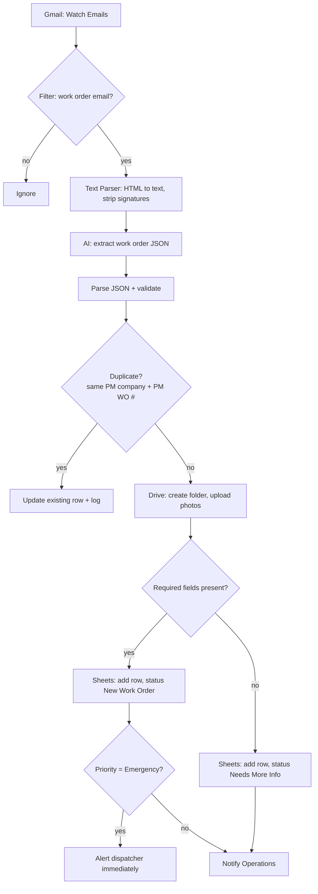

# Scenario 1 — Work Order Intake & AI Extraction

| | |
|---|---|
| **Make.com name** | `01 - Work Order Intake AI Extraction` |
| **Trigger** | New email in the maintenance inbox |
| **Exit status** | `New Work Order` (complete) or `Needs More Info` (missing data) |
| **Systems** | Gmail, OpenAI / Claude, Google Drive, Google Sheets |
| **Rules** | WO-1, WO-3, WO-4 |

## Objective

Receive maintenance requests from AppFolio, Property Meld, Rentvine, and Buildium, extract the work order details with AI, store the photos, and create one clean record in the Work Orders sheet. Every later scenario depends on this data, so nothing incomplete moves forward.

## Flow



## Before you build

Create the spreadsheet **AI Maintenance Operations Database** with the tabs from [`data/sheets/`](../../data/sheets) (at minimum `work_orders`, `pm_companies`, `status_history`, `exceptions`).

## Modules

| # | Module | Configuration |
|---|--------|---------------|
| 1 | **Gmail → Watch Emails** | Folder: maintenance inbox (or a label applied by a Gmail filter). Criteria: unread. Max results: 10. Outputs: email ID, sender, subject, body (HTML + text), attachments, date. |
| 2 | **Filter** | Subject contains `Work Order` OR `Maintenance` OR `Repair Request`, **or** sender domain is in the PM Companies list. Passes "New Maintenance Request – AppFolio"; rejects marketing email. |
| 3 | **Text Parser → HTML to text** | Input: body HTML. Then **Text Parser → Replace** to cut everything after common signature markers (`--`, `Sent from`, confidentiality footers). |
| 4 | **OpenAI → Create a Completion** (or **Anthropic Claude → Create a Message**) | Prompt: [`prompts/01-work-order-extraction.md`](../../prompts/01-work-order-extraction.md). Temperature 0. Response format: JSON schema [`work_order.schema.json`](../../prompts/schemas/work_order.schema.json). |
| 5 | **JSON → Parse JSON** | Data structure generated from the schema. Optional: **HTTP → POST /extraction** to the rules engine to validate and normalize in one step. |
| 6 | **Google Sheets → Search Rows** (idempotency) | Sheet `work_orders`, filter `pm_work_order_number` = extracted number AND `pm_company_name` = extracted company. If found → route to **Update a Row** and stop. |
| 7 | **Google Sheets → Search Rows** (PM company) | Sheet `pm_companies`, match on name or sender domain. Supplies `pm_company_id` and `default_nte_limit`. |
| 8 | **Google Drive → Create a Folder** + **Iterator** + **Upload a File** | Folder `Maintenance Photos/{record_id} {pm_work_order_number}`. Upload each image attachment. Save the folder URL. |
| 9 | **Tools → Set Variable** | `record_id` = `MO-{{formatDate(now; "YYYY")}}-{{padStart(row count + 1; 4; "0")}}`; `status` = `New Work Order` if all required fields present, else `Needs More Info`. Required: PM company, PM WO #, address, tenant name, issue, and phone or email. |
| 10 | **Google Sheets → Add a Row** | Sheet `work_orders`. Mapping below. |
| 11 | **Google Sheets → Add a Row** | Sheet `status_history`: `""` → status, changed_by `Make: 01 Intake`. |
| 12 | **Router → Gmail / Twilio** | Emergency → SMS + email to on-call dispatcher now. Needs More Info → email Operations with the missing fields. Otherwise → email Operations "New work order received". |

**Error handler** on modules 4, 8, 10: **Break** with 3 retries, then add a row to `exceptions` (`type` = `Intake failed`) and email Operations with the original email link.

### Field mapping (module 10)

| Sheet column | Source |
|--------------|--------|
| `record_id` | Variable from module 9 |
| `pm_work_order_number` | `pm_work_order_number` |
| `source_platform` | `source_platform` |
| `pm_company_id`, `pm_company_name` | Module 7 |
| `received_at` | Email date |
| `status` | Variable from module 9 |
| `priority`, `trade` | AI output |
| `nte_limit` | AI `nte_limit`, else PM company `default_nte_limit` |
| `property_address`, `unit` | AI output |
| `tenant_name`, `tenant_phone`, `tenant_email` | AI output |
| `issue_description`, `entry_instructions`, `pet_notes` | AI output |
| `photos_folder_url` | Module 8 |
| `next_action` / `next_action_owner` | `Verify customer` / `Automation`, or `Complete missing info` / `Operations` |
| `last_updated_at` | `now` |

## Messages

**Operations notification**

```text
New work order received
PM WO #: {{pm_work_order_number}} ({{pm_company_name}})
Tenant: {{tenant_name}}
Address: {{property_address}} {{unit}}
Issue: {{issue_description}}
Priority: {{priority}}
Next step: customer verification (automatic)
```

## Test checklist

- [ ] Send [`data/samples/sample_work_order_email.txt`](../../data/samples/sample_work_order_email.txt) to the inbox; one row appears with status `New Work Order`.
- [ ] Extracted values match [`sample_ai_extraction.json`](../../data/samples/sample_ai_extraction.json); phone normalized, NTE = 120.
- [ ] Photos are in a Drive folder named after the record; the URL is in the row.
- [ ] Sending the same email again updates the row instead of adding a second one.
- [ ] An email missing the tenant phone and email lands as `Needs More Info` and Operations is notified.
- [ ] An email containing "water pouring through ceiling" is classified Emergency and the dispatcher gets an SMS.
- [ ] A marketing email is filtered out.
- [ ] `status_history` has one row for the new record.
