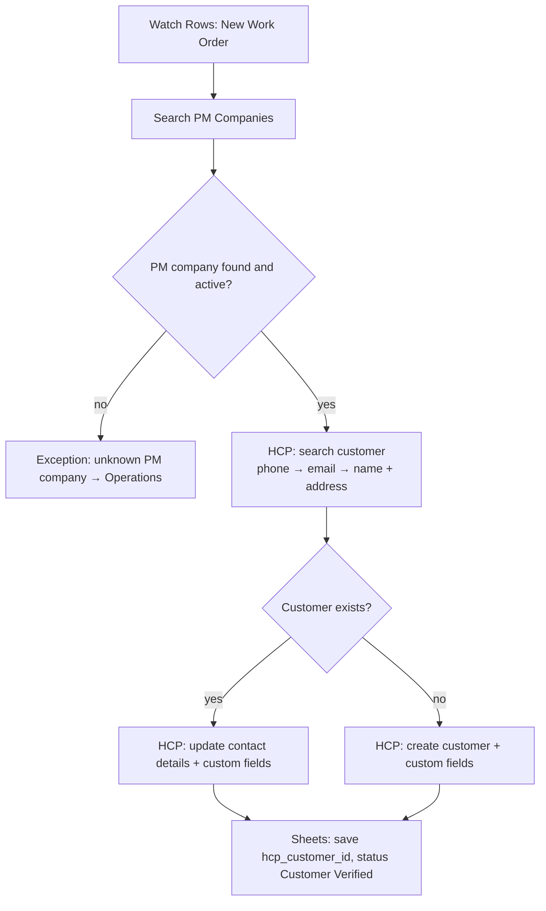

# Scenario 2 — Tenant Verification & PM Company Linking

| | |
|---|---|
| **Make.com name** | `02 - Tenant Verification HCP Customer` |
| **Trigger** | Google Sheets → Watch Rows, `status` = `New Work Order` |
| **Exit status** | `Customer Verified` |
| **Systems** | Google Sheets, Housecall Pro |
| **Rules** | WO-1, WO-2 |

## Objective

Find or create the tenant as a Housecall Pro customer and attach the PM company relationship in **dedicated custom fields**, so billing and approvals can route on them later.

## Flow



## Modules

| # | Module | Configuration |
|---|--------|---------------|
| 1 | **Google Sheets → Watch Rows** | Sheet `work_orders`. Followed by a filter: `status` = `New Work Order`. |
| 2 | **Google Sheets → Search Rows** | Sheet `pm_companies`, `pm_company_id` = row value. Returns billing email, approval email, default NTE, payment terms. |
| 3 | **Filter** | PM company found AND `active` = Yes. Else → exception `Unknown PM company`. |
| 4 | **Housecall Pro → Search customers** (HTTP module to the HCP API if the native app isn't available on your plan) | Search order: tenant phone, then tenant email, then name + service address. |
| 5 | **Router** | Route A: customer found. Route B: not found. |
| 6A | **HCP → Update customer** | Phone, email, address. Custom fields: `PM Company`, `PM Company ID`, `Billing Account`, `Work Order Source`. |
| 6B | **HCP → Create customer** | Name, phone, email, service address + the same custom fields. |
| 7 | **Google Sheets → Update a Row** | `hcp_customer_id`, `status` = `Customer Verified`, `next_action` = `Create initial estimate`. |
| 8 | **Google Sheets → Add a Row** | `customers` (Route B only) and `status_history`. |

## Data structure in Housecall Pro

Use custom fields, not notes:

```text
❌ Notes: "PM Company - ABC Management"

✅ Customer:  John Smith
   Address:   123 Main St, Unit 204
   Custom fields:
     PM Company:      ABC Property Management
     PM Company ID:   PM001
     Billing Account: ABC-001
```

## Test checklist

- [ ] Existing tenant (same phone) is updated, not duplicated.
- [ ] New tenant is created with all PM custom fields filled.
- [ ] Work order row has `hcp_customer_id` and status `Customer Verified`.
- [ ] A work order from an unknown PM company creates an exception and stops.
