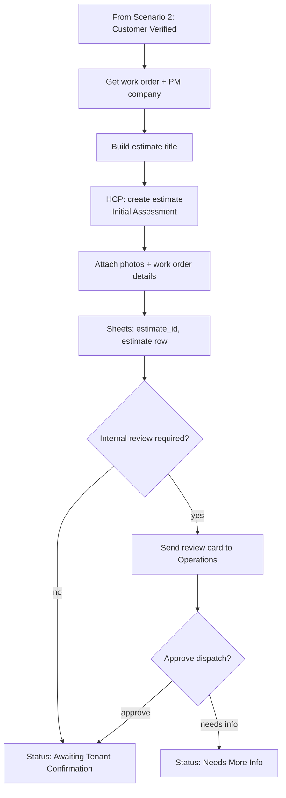

# Scenario 3 — Initial Assessment Estimate & Internal Review

| | |
|---|---|
| **n8n workflow** | `Maintenance Ops · Work Order Lifecycle` → intake branch (`S03`) |
| **Trigger** | None of its own: continues from Scenario 2 |
| **Exit status** | `Awaiting Tenant Confirmation` (or `Needs More Info` if the reviewer holds it) |
| **Systems** | Google Sheets, Housecall Pro, Gmail / Slack |
| **Rules** | EST-1, EST-2, EST-4 |

## Objective

Create the **Initial Assessment Estimate** in Housecall Pro for every verified work order. This is the official record of the request, not the repair price. It carries the PM WO # in its title and is updated in place after the assessment (Scenario 6).

## Flow

## n8n nodes

| # | Node | Configuration |
|---|------|---------------|
| 1 | **Edit Fields (Set)** · estimate title | `estimate_title` = `{{pm_work_order_number}} - {{trade || "General Maintenance"}} Assessment - {{property_address}}` |
| 2 | **HTTP Request** · HCP create estimate | Customer `hcp_customer_id`, address, title, one line item "Initial assessment" at $0, notes with issue, entry instructions, PM WO #, NTE. |
| 3 | **HTTP Request** · HCP attach photos | One request per photo (n8n runs once per item automatically). |
| 4 | **Google Sheets → Append Row** (`estimates`) | `estimate_type` = `Initial Assessment`, `status` = `Created`. |
| 5 | **IF** · internal review needed? | True when priority = Emergency, NTE missing, or the issue description is under 15 characters. |
| 6 | **Slack → Send Message** (or Gmail) + **Wait** · On Webhook Call | Review card with **Approve** / **Needs info** links that resume the execution (the Wait node's `$execution.resumeUrl` with `?decision=approve`). Timeout 4 h → treat as approved and log it. |
| 7 | **Google Sheets → Update Row** | `estimate_id`, `estimate_title`, `status` = `Awaiting Tenant Confirmation` (or `Needs More Info`); append history. |
| 8 | → continues | Into Scenario 4's outbound message. |

## Internal review checklist (for the reviewer)

Work order details · estimate · priority · NTE limit · tenant information. Decision: **approve assessment dispatch** or **request more information**.

## Test checklist

- [ ] Estimate exists in HCP with title `WO-45891 - Plumbing Assessment - 123 Main St`.
- [ ] Photos are attached to the estimate.
- [ ] `estimate_id` saved; status `Awaiting Tenant Confirmation`.
- [ ] Emergency work order triggers a review card; "Needs info" sets `Needs More Info`.
