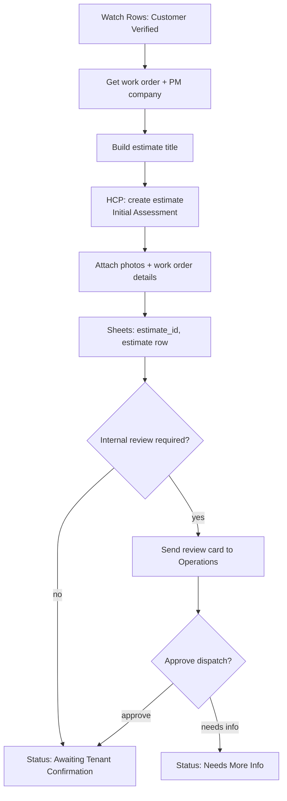

# Scenario 3 — Initial Assessment Estimate & Internal Review

| | |
|---|---|
| **Make.com name** | `03 - Initial Assessment Estimate` |
| **Trigger** | Watch Rows, `status` = `Customer Verified` |
| **Exit status** | `Awaiting Tenant Confirmation` (or `Needs More Info` if the reviewer holds it) |
| **Systems** | Google Sheets, Housecall Pro, Gmail / Slack |
| **Rules** | EST-1, EST-2, EST-4 |

## Objective

Create the **Initial Assessment Estimate** in Housecall Pro for every verified work order. This is the official record of the request, not the repair price. It carries the PM WO # in its title and is updated in place after the assessment (Scenario 6).

## Flow

## Modules

| # | Module | Configuration |
|---|--------|---------------|
| 1 | **Watch Rows** + filter | `status` = `Customer Verified` |
| 2 | **Tools → Set Variable** | `estimate_title` = `{{pm_work_order_number}} - {{trade or "General Maintenance"}} Assessment - {{property_address}}` |
| 3 | **HCP → Create estimate** | Customer: `hcp_customer_id`. Address. Title from module 2. Line item: "Initial assessment" at $0 (pricing comes later). Notes: issue description, entry instructions, PM WO #, NTE. |
| 4 | **HCP → Upload attachment** | Photos from the Drive folder. |
| 5 | **Sheets → Add a Row** (`estimates`) | `estimate_type` = `Initial Assessment`, `status` = `Created`. |
| 6 | **Router: internal review** | Review required when priority = Emergency, NTE missing, or issue description under 15 characters. Otherwise skip. |
| 7 | **Slack / Gmail → Send** | Review card with **Approve** and **Needs info** links (Make webhooks). |
| 8 | **Sheets → Update a Row** | `estimate_id`, `estimate_title`, `status`, `next_action`. Append to `status_history`. |

## Internal review checklist (for the reviewer)

Work order details · estimate · priority · NTE limit · tenant information. Decision: **approve assessment dispatch** or **request more information**.

## Test checklist

- [ ] Estimate exists in HCP with title `WO-45891 - Plumbing Assessment - 123 Main St`.
- [ ] Photos are attached to the estimate.
- [ ] `estimate_id` saved; status `Awaiting Tenant Confirmation`.
- [ ] Emergency work order triggers a review card; "Needs info" sets `Needs More Info`.
