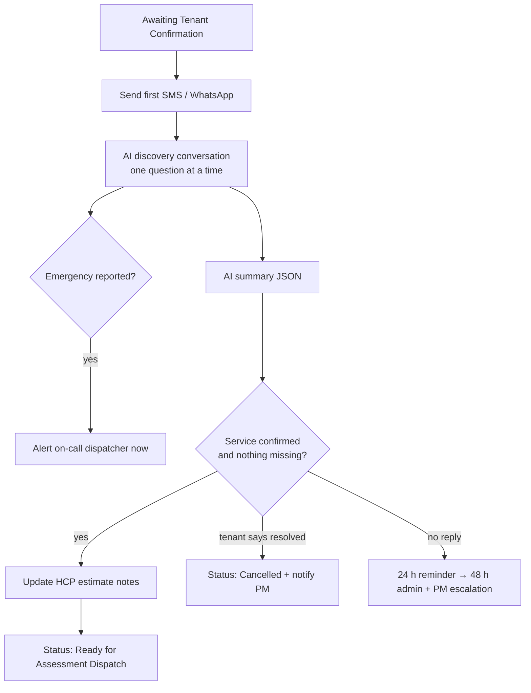

# Scenario 4 — Tenant Confirmation & Discovery

| | |
|---|---|
| **n8n workflow** | `Maintenance Ops · Work Order Lifecycle` → outbound at the end of intake; replies in the `sms` → `tenant_reply` branch (`S04`) |
| **Trigger** | Outbound: continues from Scenario 3. Replies: **Webhook** `POST /events/sms` (Twilio inbound) |
| **Exit status** | `Ready for Assessment Dispatch` (or `Waiting Tenant Response`, `Cancelled`) |
| **Systems** | Twilio SMS / WhatsApp Cloud API, OpenAI / Claude, HCP, Google Sheets |
| **Rules** | DIS-1, follow-up timers (tenant) |

## Objective

Before a technician goes out, confirm the tenant still needs service and collect everything the technician needs: updated details, photos, availability, entry instructions, pets, and safety information. This prevents wasted trips.

## Flow

## n8n nodes

**Outbound (end of the intake branch)**

| # | Node | Configuration |
|---|------|---------------|
| 1 | **Twilio → Send SMS** (or **WhatsApp Business Cloud → Send Message** with a template) | Opening message: "Hi {{first_name}}, this is {{vendor}} about your maintenance request at {{address}}. Do you still need service?" |
| 2 | **Google Sheets → Update Row** | `tenant_contacted_at`, `first_tenant_contact_at` = now; append `communication_log`. |

**Replies (event router)**

| # | Node | Configuration |
|---|------|---------------|
| 1 | **Webhook** `POST /events/:event` | Respond immediately with an empty TwiML `<Response/>` (via **Respond to Webhook**) so Twilio doesn't retry. |
| 2 | **Switch** · route by event | `sms` output → node 3. |
| 3 | **Google Sheets → Get Row(s)** | Active work order where `tenant_phone` = sender. |
| 4 | **Switch** · by status | `Awaiting Tenant Confirmation` / `Waiting Tenant Response` → `tenant_reply` (this scenario). `Ready for Tenant Confirmation` → `tenant_signoff` (Scenario 9). |
| 5 | **AI Agent** · Tenant Agent | System prompt [`prompts/03-tenant-discovery.md`](../../prompts/03-tenant-discovery.md). **Simple Memory** keyed by `record_id` (session key) holds the conversation across messages. **Structured Output Parser** returns the summary JSON when done. |
| 6 | **Twilio → Send SMS** | The agent's reply. |
| 7 | **IF** · complete? | `service_confirmed` and `missing` is empty. False → stop (wait for the next SMS). |
| 8 | **IF** · emergency? | True → SMS on-call dispatcher. |
| 9 | **HTTP Request** · HCP update estimate notes | Availability, entry, pets, issue update. |
| 10 | **Google Sheets → Update Row** | Fields below, status `Ready for Assessment Dispatch` → continues into Scenario 5. |

## Discovery questions

| Topic | Example question |
|-------|------------------|
| Confirmation | "We received your maintenance request. Do you still need service for this issue?" |
| Changes | "Has the issue changed or gotten worse since you reported it?" |
| Photos | "If you can, please send a photo or short video." |
| Availability | "What days and times work for a technician to come take a look?" |
| Entry | "Any gate code, lockbox, or instructions for getting in?" |
| Pets | "Will there be any pets at home?" |
| Safety | "Is water still leaking? Is the water shut off?" (only when relevant) |

## Data written

| Column | Example |
|--------|---------|
| `tenant_confirmed` | Yes |
| `preferred_windows` | Tue 14:00-17:00; Wed 09:00-12:00 |
| `entry_instructions` | Gate code 4589. Call before arrival. |
| `pet_notes` | Dog in backyard |
| `issue_description` | (appended) Leak now affecting the cabinet below the sink |
| `status` | Ready for Assessment Dispatch |

## Test checklist

- [ ] Tenant receives the first SMS within 15 minutes of intake.
- [ ] A full conversation produces the summary JSON and moves the work order forward.
- [ ] "It's fixed already" sets `Cancelled` and notifies the PM.
- [ ] "Water is pouring out" alerts the dispatcher immediately.
- [ ] No reply → reminder at 24 h, admin + PM escalation at 48 h (Scenario 12).
- [ ] The AI never mentions prices or limits.
