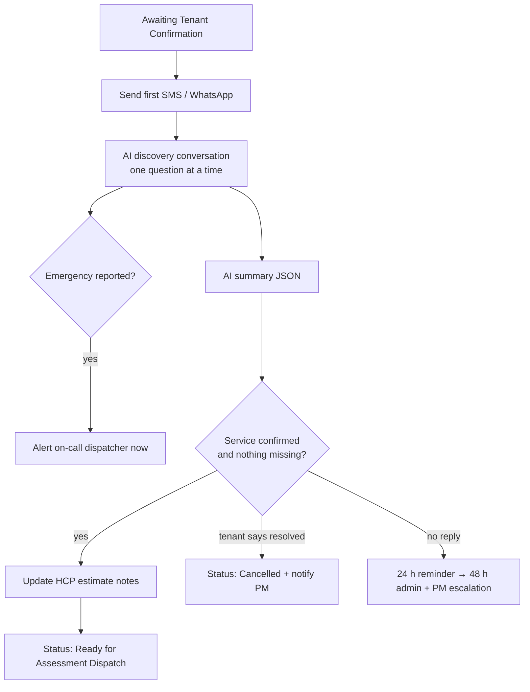

# Scenario 4 — Tenant Confirmation & Discovery

| | |
|---|---|
| **Make.com name** | `04 - Tenant Confirmation Discovery` |
| **Trigger** | Watch Rows, `status` = `Awaiting Tenant Confirmation` |
| **Exit status** | `Ready for Assessment Dispatch` (or `Waiting Tenant Response`, `Cancelled`) |
| **Systems** | Twilio SMS / WhatsApp Cloud API, OpenAI / Claude, HCP, Google Sheets |
| **Rules** | DIS-1, follow-up timers (tenant) |

## Objective

Before a technician goes out, confirm the tenant still needs service and collect everything the technician needs: updated details, photos, availability, entry instructions, pets, and safety information. This prevents wasted trips.

## Flow

## Modules

Two scenarios work together:

**4a — Outbound (Watch Rows)**

| # | Module | Configuration |
|---|--------|---------------|
| 1 | Watch Rows + filter | `status` = `Awaiting Tenant Confirmation` and `tenant_contacted_at` empty |
| 2 | **Twilio → Send SMS** (or WhatsApp template message) | Opening message below |
| 3 | Sheets → Update a Row | `tenant_contacted_at`, `first_tenant_contact_at` = now |
| 4 | Sheets → Add a Row | `communication_log` |

**4b — Conversation (Webhook from Twilio / WhatsApp)**

| # | Module | Configuration |
|---|--------|---------------|
| 1 | **Webhooks → Custom webhook** | Twilio inbound SMS / WhatsApp webhook |
| 2 | Sheets → Search Rows | Find the active work order by tenant phone |
| 3 | **Data store → Get record** | Conversation history keyed by `record_id` |
| 4 | **AI → Create a Completion** | System prompt [`prompts/03-tenant-discovery.md`](../../prompts/03-tenant-discovery.md) + history + new message |
| 5 | Twilio → Send SMS | AI reply |
| 6 | Data store → Update record | Append both messages |
| 7 | **AI → Create a Completion** (summary) | Returns the summary JSON when the agent says it is done |
| 8 | Router | Emergency → dispatcher alert. Complete → update HCP + Sheets. Resolved → Cancelled. |

## Discovery questions

| Topic | Example question |
|-------|------------------|
| Confirmation | "We received your maintenance request. Do you still need service for this issue?" |
| Changes | "Has the issue changed or gotten worse since you reported it?" |
| Photos | "If you can, please send a photo or short video." |
| Availability | "What days and times work for a technician to come take a look?" |
| Entry | "Any gate code, lockbox, or instructions for getting in?" |
| Pets | "Will there be any pets at home?" |
| Safety | "Is water still leaking? Is the water shut off?" (only when relevant) |

## Data written

| Column | Example |
|--------|---------|
| `tenant_confirmed` | Yes |
| `preferred_windows` | Tue 14:00-17:00; Wed 09:00-12:00 |
| `entry_instructions` | Gate code 4589. Call before arrival. |
| `pet_notes` | Dog in backyard |
| `issue_description` | (appended) Leak now affecting the cabinet below the sink |
| `status` | Ready for Assessment Dispatch |

## Test checklist

- [ ] Tenant receives the first SMS within 15 minutes of intake.
- [ ] A full conversation produces the summary JSON and moves the work order forward.
- [ ] "It's fixed already" sets `Cancelled` and notifies the PM.
- [ ] "Water is pouring out" alerts the dispatcher immediately.
- [ ] No reply → reminder at 24 h, admin + PM escalation at 48 h (Scenario 12).
- [ ] The AI never mentions prices or limits.
