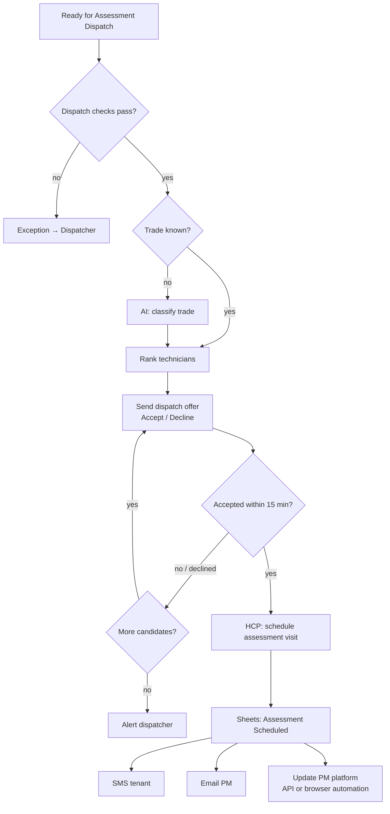

# Scenario 5 — Assessment Dispatch

| | |
|---|---|
| **Make.com name** | `05 - Assessment Dispatch` |
| **Trigger** | Watch Rows, `status` = `Ready for Assessment Dispatch` |
| **Exit status** | `Assessment Scheduled` |
| **Systems** | Google Sheets, OpenAI / Claude, WhatsApp / SMS, HCP, Gmail, PM platform |
| **Rules** | DIS-1, DIS-2, DIS-4, technician acceptance timer |
| **Code** | `maintenance_ops.dispatch.rank_technicians` |

## Objective

Assign the best technician for the onsite assessment, get their acceptance, book the HCP appointment, and tell the tenant and the PM.

## Flow



## Dispatch checks (DIS-1)

Tenant confirmed ✅ · availability received ✅ · entry instructions collected ✅ · initial estimate exists ✅ · HCP customer exists ✅

## Modules

| # | Module | Configuration |
|---|--------|---------------|
| 1 | Watch Rows + filter | `status` = `Ready for Assessment Dispatch` |
| 2 | Filter | Dispatch checks above |
| 3 | AI (only if `trade` empty) | [`prompts/02-trade-classification.md`](../../prompts/02-trade-classification.md) |
| 4 | Sheets → Search Rows (`technicians`) | `active` = Yes, trade, service area, available day, `current_jobs` < `max_daily_jobs`. Sort by workload, then rating. |
| 5 | **Repeater / Iterator** over ranked technicians | For each: send offer, then **Webhook response wait** (or a Data store flag polled by a 1-minute scenario) up to 15 minutes |
| 6 | **WhatsApp Cloud API → Send template** with quick-reply buttons | Dispatch package below |
| 7 | HCP → Create appointment / schedule estimate visit | Title `{{pm_work_order_number}} - {{trade}} Assessment`, window, assigned technician |
| 8 | Sheets → Update a Row | `assessment_technician`, `assessment_scheduled_at`, `status` = `Assessment Scheduled`; append `status_history` |
| 9 | Twilio → SMS tenant | Template below |
| 10 | Gmail → PM | Template below, to `approval_email` |
| 11 | PM platform update | API if available; otherwise a Playwright job (log in, open WO, set status, enter appointment, save) |

## Dispatch package (technician view — no PM company, no money)

```text
🔧 NEW ASSESSMENT
Estimate: {{estimate_id}}
Address: {{property_address}} {{unit}}
Tenant: {{tenant_name}} · {{tenant_phone}}
Trade: {{trade}} · Priority: {{priority}}
Issue: {{issue_description}}
Window: {{appointment_window}}
Entry: {{entry_instructions}}
Pets: {{pet_notes}}
Photos: {{photos_folder_url}}

[ Accept ]  [ Decline ]
```

## Messages

**Tenant**

```text
Your maintenance assessment is scheduled for {{date}}, {{window}}. Technician: {{technician_first_name}}.
Please make sure we can access the unit. Reply to this message if you need to reschedule.
```

**Property manager**

```text
Subject: Assessment scheduled – {{pm_work_order_number}}
Work order {{pm_work_order_number}} at {{property_address}} {{unit}} is scheduled for assessment on {{date}}, {{window}}.
We will send findings and an estimate if the repair exceeds your {{nte_limit}} limit.
```

## Test checklist

- [ ] With two eligible plumbers, the lighter-loaded one gets the offer first.
- [ ] Declining passes the offer to the next technician; nobody accepting alerts the dispatcher.
- [ ] HCP appointment created with the right technician and window.
- [ ] The technician message contains no PM company, PM WO #, or prices.
- [ ] Tenant SMS and PM email sent and logged.
