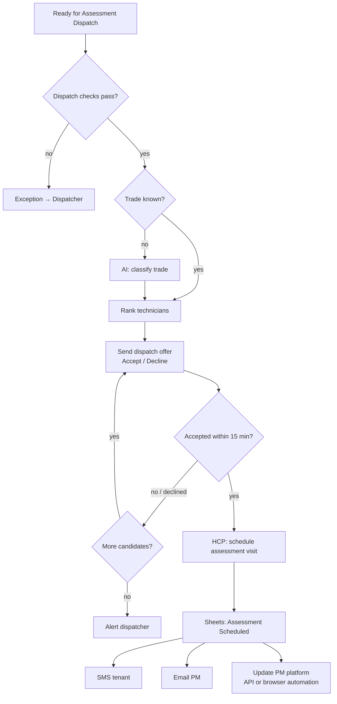

# Scenario 5 — Assessment Dispatch

| | |
|---|---|
| **n8n workflow** | `Maintenance Ops · Work Order Lifecycle` → `tenant_reply` branch after the IF complete (`S05`); technician answers on `/events/dispatch_reply` |
| **Trigger** | None of its own: continues from Scenario 4 |
| **Exit status** | `Assessment Scheduled` |
| **Systems** | Google Sheets, OpenAI / Claude, WhatsApp / SMS, HCP, Gmail, PM platform |
| **Rules** | DIS-1, DIS-2, DIS-4, technician acceptance timer |
| **Code** | `maintenance_ops.dispatch.rank_technicians` |

## Objective

Assign the best technician for the onsite assessment, get their acceptance, book the HCP appointment, and tell the tenant and the PM.

## Flow



## Dispatch checks (DIS-1)

Tenant confirmed ✅ · availability received ✅ · entry instructions collected ✅ · initial estimate exists ✅ · HCP customer exists ✅

## n8n nodes

| # | Node | Configuration |
|---|------|---------------|
| 1 | **IF** · dispatch checks | DIS-1 checks above. False → append to `exceptions`. |
| 2 | **Text Classifier** (only if `trade` is empty) | Categories from `config/business_rules.yaml`; prompt [`prompts/02-trade-classification.md`](../../prompts/02-trade-classification.md). |
| 3 | **Google Sheets → Get Row(s)** (`technicians`) | `active` = Yes. |
| 4 | **Code** · rank technicians | Port of `maintenance_ops.dispatch.rank_technicians`: trade, area, available day, capacity; sort by exact trade, workload, rating. Returns the ordered list. |
| 5 | **WhatsApp Business Cloud → Send Message** | Template with **Accept** / **Decline** quick replies to the first candidate. Button replies arrive at `POST /events/dispatch_reply`. |
| 6 | **Wait** · On Webhook Call, timeout 15 min | Resumed by the `dispatch_reply` branch (it calls the stored `resumeUrl`). Declined or timed out → **Loop Over Items** to the next candidate; none left → Slack the dispatcher. |
| 7 | **HTTP Request** · HCP schedule estimate visit | Title `{{pm_work_order_number}} - {{trade}} Assessment`, window, technician. |
| 8 | **Google Sheets → Update Row** | `assessment_technician`, `assessment_scheduled_at`, status `Assessment Scheduled`; append history. |
| 9 | **Twilio → Send SMS** | Tenant appointment message. |
| 10 | **Gmail → Send** | PM notice to `approval_email`. |
| 11 | **HTTP Request** or **Execute Workflow** | PM platform update: API if available, otherwise a sub-workflow that calls a Playwright service (log in, open WO, set status and appointment, save). |

## Dispatch package (technician view — no PM company, no money)

```text
🔧 NEW ASSESSMENT
Estimate: {{estimate_id}}
Address: {{property_address}} {{unit}}
Tenant: {{tenant_name}} · {{tenant_phone}}
Trade: {{trade}} · Priority: {{priority}}
Issue: {{issue_description}}
Window: {{appointment_window}}
Entry: {{entry_instructions}}
Pets: {{pet_notes}}
Photos: {{photos_folder_url}}

[ Accept ]  [ Decline ]
```

## Messages

**Tenant**

```text
Your maintenance assessment is scheduled for {{date}}, {{window}}. Technician: {{technician_first_name}}.
Please make sure we can access the unit. Reply to this message if you need to reschedule.
```

**Property manager**

```text
Subject: Assessment scheduled – {{pm_work_order_number}}
Work order {{pm_work_order_number}} at {{property_address}} {{unit}} is scheduled for assessment on {{date}}, {{window}}.
We will send findings and an estimate if the repair exceeds your {{nte_limit}} limit.
```

## Test checklist

- [ ] With two eligible plumbers, the lighter-loaded one gets the offer first.
- [ ] Declining passes the offer to the next technician; nobody accepting alerts the dispatcher.
- [ ] HCP appointment created with the right technician and window.
- [ ] The technician message contains no PM company, PM WO #, or prices.
- [ ] Tenant SMS and PM email sent and logged.
