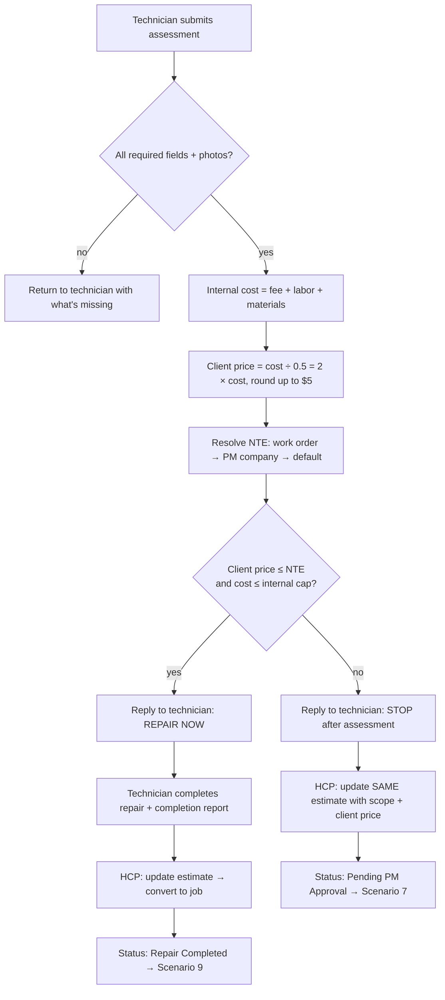

# Scenario 6 — Assessment, Pricing & Budget Decision

| | |
|---|---|
| **n8n workflow** | `Maintenance Ops · Work Order Lifecycle` → `assessment_submitted` branch (`S06`) |
| **Trigger** | **Webhook** `POST /events/assessment_submitted` (technician form: n8n Form, Jotform or Typeform) |
| **Exit status** | `Repair Completed` (same visit) or `Pending PM Approval` |
| **Systems** | Form (HCP checklist, Jotform, or Typeform), HCP, Google Sheets, Google Drive |
| **Rules** | PR-1 to PR-4, NTE-1 to NTE-4, EST-3, FEE-3 |
| **Code** | `maintenance_ops.pricing.decide`, `maintenance_ops.visibility.client_view` |
| **Decision record** | [ADR-001](../decisions/ADR-001-budget-decision-rule.md) |

## Objective

Collect the technician's assessment, calculate internal cost and client price, and decide in real time, while the technician is still on site, whether to **repair now** or **stop and request approval**. Keep internal costs away from the PM.

> This merges the two "Scenario 6" sections of the original design into one rule. See the [design review](../design-review.md).

## Flow



## Technician submission

Schema: [`prompts/schemas/assessment.schema.json`](../../prompts/schemas/assessment.schema.json).

| Field | Example |
|-------|---------|
| Estimate | EST-10001 |
| Findings | Braided supply line under the kitchen sink is corroded and actively leaking. |
| Troubleshooting | Verified water source · checked shut-off valve · pressure-tested line |
| Root cause | Corroded braided supply line |
| Recommendation | Replace supply line and compression fittings |
| Scope of work | Remove damaged line · install new line and fittings · pressure test · verify no leaks · clean area |
| Assessment fee cost (internal) | $75 |
| Labor (internal) | $120 |
| Materials (internal) | $45 |
| Photos | Before, during |

## n8n nodes

| # | Node | Configuration |
|---|------|---------------|
| 1 | **Switch** · route by event | `assessment_submitted` output. |
| 2 | **Code** · validate form | Check the schema's required fields and ≥ 1 photo. Missing → **WhatsApp** the technician what's missing and stop. |
| 3 | **Google Sheets → Get Row(s)** | Work order by `estimate_id`; PM company for `default_nte_limit`. |
| 4 | **HTTP Request** · `POST {{RULES_ENGINE_URL}}/decide` | Body: `assessment_fee`, `labor`, `materials`, `nte_limit`, `pm_default_nte`. Returns `outcome`, `internal_total`, `client_price`, `over_by`, `next_status`. Runs [`maintenance_ops.server`](../../src/maintenance_ops/server.py). |
| 5 | **Google Sheets → Append Row** (`assessments`) | Internal costs, `client_price`, `target_margin_pct`. |
| 6 | **IF** · ≤ NTE? | `outcome` = `WITHIN_LIMIT`. |
| 7a | **WhatsApp → Send Message** | "REPAIR NOW – within approved limit." No amounts. Then **Google Sheets → Update Row**: status `Repair Completed`, `first_visit_resolution` = Yes. The technician's completion report later arrives on `/events/job_completed` (Scenario 9). |
| 7b | **WhatsApp → Send Message** | "STOP after assessment – approval needed." |
| 8b | **HTTP Request** · HCP update estimate (same ID) | Findings, recommendation, scope, photos, one line "{{trade}} repair" at `client_price`, the FEE-3 disclaimer. |
| 9b | **Gmail → Send** · approval request | Scenario 7's package. Then **Google Sheets → Update Row**: status `Pending PM Approval`, `approval_requested_at` = now. |

**No rules engine hosted?** Replace node 4 with a **Code** node:

```js
const t = $json.assessment_fee + $json.labor + $json.materials;
const price = Math.ceil(t / (1 - 0.50) / 5) * 5;         // 50% margin; keep in sync with config/business_rules.yaml
return [{ json: { ...$json, internal_total: t, client_price: price,
  outcome: price <= $json.nte_limit ? 'WITHIN_LIMIT' : 'APPROVAL_REQUIRED' } }];
```

## Worked examples

| | Within NTE | Over NTE |
|---|---|---|
| Internal cost | $75 + $60 + $25 = $160 | $75 + $120 + $45 = $240 |
| Client price | $160 ÷ 0.5 = $320 | $240 ÷ 0.5 = $480 |
| NTE | $350 | $120 |
| Outcome | Repair now | Approval required (over by $360) |

## Client estimate (what the PM sees)

```text
Estimate #: EST-10001
PM Work Order #: WO-45891
Property: 123 Main St, Unit 204 · Tenant: John Smith
Service: Plumbing repair

Assessment findings
The braided supply line beneath the kitchen sink has failed due to corrosion.

Recommended repair
• Replace braided supply line  • Replace compression fittings
• Pressure test plumbing       • Verify no additional leaks  • Clean work area

Plumbing repair ............................................ $480.00
Total ...................................................... $480.00

Assessment fee credit: If this estimate is approved and the repair is authorized, the
assessment fee will be credited toward the total repair cost and will not be billed
separately. If the estimate is declined, only the assessment fee will be invoiced.
```

**Never shown to the PM:** assessment fee cost, labor, materials, internal total, target margin, technician pay, profit.

## Test checklist

- [ ] Incomplete form (no photos) is returned to the technician.
- [ ] $160 internal / $350 NTE → $320 price → "REPAIR NOW"; status ends `Repair Completed`; `first_visit_resolution` = Yes.
- [ ] $240 internal / $120 NTE → "STOP"; same estimate ID updated to $480; status `Pending PM Approval`.
- [ ] A client price exactly equal to the NTE is treated as within the limit.
- [ ] The PM-facing estimate passes `leaked_fields() == []`.
- [ ] No new estimate is created in HCP.
