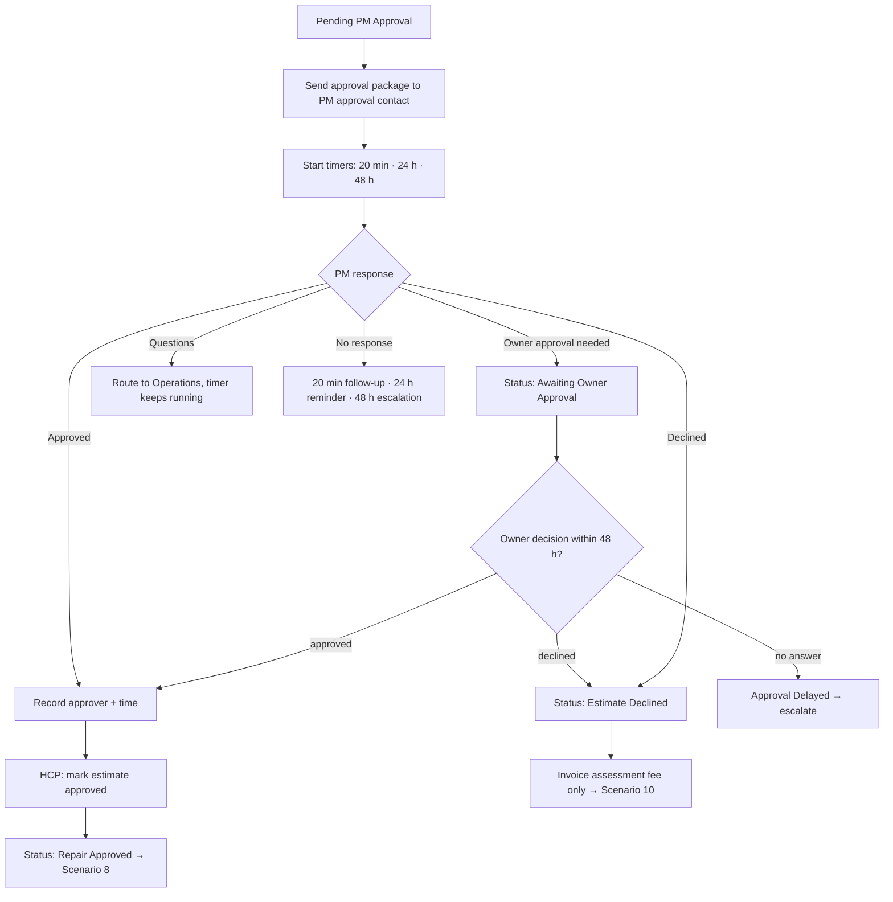

# Scenario 7 — PM Approval & Owner Authorization

| | |
|---|---|
| **n8n workflow** | `Maintenance Ops · Work Order Lifecycle` → request sent at the end of Scenario 6; replies in the `pm_reply` branch (`S07`) |
| **Trigger** | **Webhook** `POST /events/pm_reply` (Housecall Pro estimate approved / declined) and a second **Gmail Trigger** for emailed replies |
| **Exit status** | `Repair Approved` or `Estimate Declined` (via `Awaiting Owner Approval` / `Approval Delayed`) |
| **Systems** | Gmail, HCP estimate approval link, Google Sheets, PM platform |
| **Rules** | Follow-up timers (PM approval, owner approval), FEE-2 |
| **Code** | `maintenance_ops.followups.approval_follow_up` |

> New in this version. The original design referenced this scenario but never specified it.

## Objective

Get a clear decision from the property manager (and the owner, when the PM needs one) as fast as possible, keep everyone informed while waiting, and record who approved what and when.

## Flow



## Approval package

Sent to `pm_companies.approval_email`, with the HCP estimate link (the PM can approve online) and reply-by-email options:

```text
Subject: Approval needed – {{pm_work_order_number}} – {{property_address}} – ${{client_price}}

Hi {{approval_contact_name}},

Our technician assessed work order {{pm_work_order_number}} at {{property_address}} {{unit}}.

Findings: {{findings}}
Recommended repair: {{recommendation}}
Price: ${{client_price}} (your limit for this work order is ${{nte_limit}})

Photos and full scope: {{estimate_link}}

Approve online at the link above, or reply APPROVE, DECLINE, or OWNER APPROVAL NEEDED.
If approved, the assessment fee is credited toward the repair. If declined, only the
assessment fee of ${{assessment_fee_client_price}} will be invoiced.
```

## n8n nodes

| # | Node | Configuration |
|---|------|---------------|
| 1 | **Webhook** → **Switch** (`pm_reply`) | Housecall Pro estimate webhook. |
| 1b | **Gmail Trigger** · approval replies | Query `subject:"Approval needed –"`. Connects into node 2 of the same branch (n8n allows several triggers in one workflow). |
| 2 | **Google Sheets → Get Row(s)** | By `estimate_id` or the PM WO # in the subject. |
| 3 | **Text Classifier** | Categories `approved`, `declined`, `owner_approval_needed`, `question` (skipped for HCP webhooks, which already carry the decision). |
| 4 | **Switch** · decision | One output per category. |
| 5 | approved → **Google Sheets → Update Row** | `approval_received_at`, `approved_by`, status `Repair Approved` → continues into Scenario 8. |
| 6 | declined → **HTTP Request** · HCP assessment-only invoice → **Google Sheets → Update Row** | Status `Estimate Declined` → `Ready for Invoice` (Scenario 10 billing path). |
| 7 | owner_approval_needed → **Google Sheets → Update Row** | Status `Awaiting Owner Approval`; timers keep running. |
| 8 | question → **Slack → Send Message** | Operations answers the PM. |
| 9 | PM platform update | API or the Playwright sub-workflow. |

**Follow-up timers** run in the separate **Exception Monitor** workflow (Scenario 12), which checks `approval_requested_at` every 10 minutes and sends the step that is due exactly once (it records each step in `communication_log`).

## Follow-up messages

| When | Message |
|------|---------|
| 20 min | "Quick follow-up on WO {{pm_work_order_number}}: the technician is standing by for approval on the ${{client_price}} repair." |
| 24 h | "Reminder: approval is still needed for WO {{pm_work_order_number}}. The tenant is waiting on this repair." |
| 48 h | Escalation to the PM's secondary contact and our Operations manager; status `Approval Delayed`. |

## Test checklist

- [ ] Approval package arrives with the estimate link and correct price; no internal costs.
- [ ] Approving in HCP moves the work order to `Repair Approved` and records approver and time.
- [ ] A reply "owner needs to sign off" sets `Awaiting Owner Approval`.
- [ ] Declining sets `Estimate Declined`, and Scenario 10 issues a $75 assessment-only invoice.
- [ ] Follow-ups send once each at 20 min, 24 h, and 48 h.
