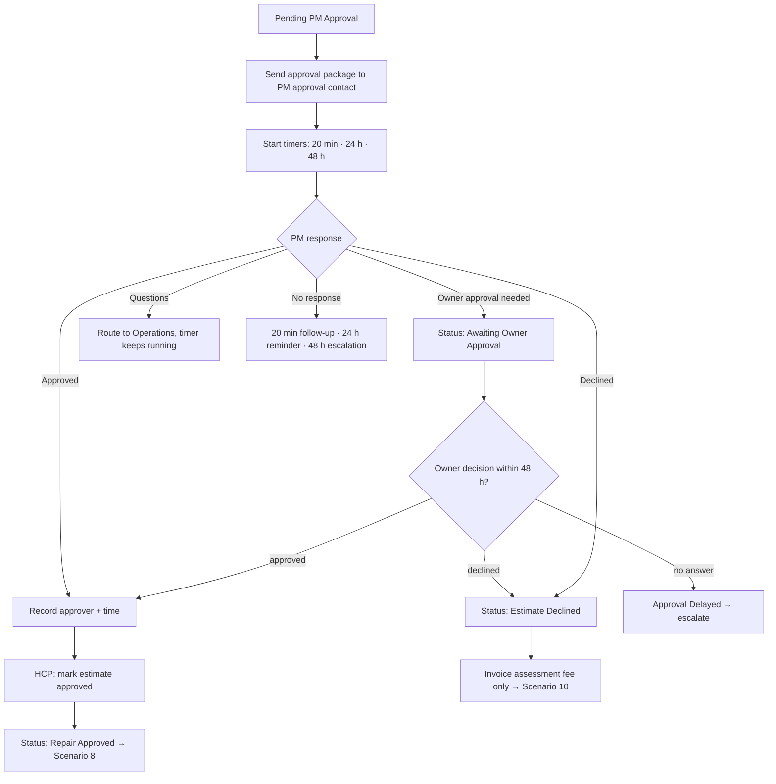

# Scenario 7 — PM Approval & Owner Authorization

| | |
|---|---|
| **Make.com name** | `07 - PM Approval Workflow` |
| **Trigger** | Watch Rows, `status` = `Pending PM Approval` |
| **Exit status** | `Repair Approved` or `Estimate Declined` (via `Awaiting Owner Approval` / `Approval Delayed`) |
| **Systems** | Gmail, HCP estimate approval link, Google Sheets, PM platform |
| **Rules** | Follow-up timers (PM approval, owner approval), FEE-2 |
| **Code** | `maintenance_ops.followups.approval_follow_up` |

> New in this version. The original design referenced this scenario but never specified it.

## Objective

Get a clear decision from the property manager (and the owner, when the PM needs one) as fast as possible, keep everyone informed while waiting, and record who approved what and when.

## Flow



## Approval package

Sent to `pm_companies.approval_email`, with the HCP estimate link (the PM can approve online) and reply-by-email options:

```text
Subject: Approval needed – {{pm_work_order_number}} – {{property_address}} – ${{client_price}}

Hi {{approval_contact_name}},

Our technician assessed work order {{pm_work_order_number}} at {{property_address}} {{unit}}.

Findings: {{findings}}
Recommended repair: {{recommendation}}
Price: ${{client_price}} (your limit for this work order is ${{nte_limit}})

Photos and full scope: {{estimate_link}}

Approve online at the link above, or reply APPROVE, DECLINE, or OWNER APPROVAL NEEDED.
If approved, the assessment fee is credited toward the repair. If declined, only the
assessment fee of ${{assessment_fee_client_price}} will be invoiced.
```

## Modules

| # | Module | Configuration |
|---|--------|---------------|
| 1 | Watch Rows + filter | `status` = `Pending PM Approval` and `approval_requested_at` empty |
| 2 | Gmail → Send | Package above; PDF of the HCP estimate attached |
| 3 | Sheets → Update | `approval_requested_at` = now, `next_action` = `Await PM approval`, `next_action_due` = now + 20 min |
| 4 | **Approval intake** (separate scenario `07b`) | Triggers: HCP webhook "estimate approved/declined" **or** Gmail Watch Emails on replies with subject `Approval needed – {{pm_work_order_number}}`. AI classifies the reply as `approved`, `declined`, `owner_approval_needed`, or `question`. |
| 5 | Router | One route per outcome (flow above) |
| 6 | Sheets → Update | `approval_received_at`, `approved_by`, status; append `status_history` and `communication_log` |
| 7 | PM platform update | Approved / declined status and note (API or browser automation) |
| 8 | **Follow-up scenario** `07c` (scheduled every 10 min) | For each `Pending PM Approval` / `Awaiting Owner Approval` row, call `approval_follow_up(approval_requested_at, now)` and send the step that is due, once. Step 3 sets `Approval Delayed` and creates an exception. |

## Follow-up messages

| When | Message |
|------|---------|
| 20 min | "Quick follow-up on WO {{pm_work_order_number}}: the technician is standing by for approval on the ${{client_price}} repair." |
| 24 h | "Reminder: approval is still needed for WO {{pm_work_order_number}}. The tenant is waiting on this repair." |
| 48 h | Escalation to the PM's secondary contact and our Operations manager; status `Approval Delayed`. |

## Test checklist

- [ ] Approval package arrives with the estimate link and correct price; no internal costs.
- [ ] Approving in HCP moves the work order to `Repair Approved` and records approver and time.
- [ ] A reply "owner needs to sign off" sets `Awaiting Owner Approval`.
- [ ] Declining sets `Estimate Declined`, and Scenario 10 issues a $75 assessment-only invoice.
- [ ] Follow-ups send once each at 20 min, 24 h, and 48 h.
