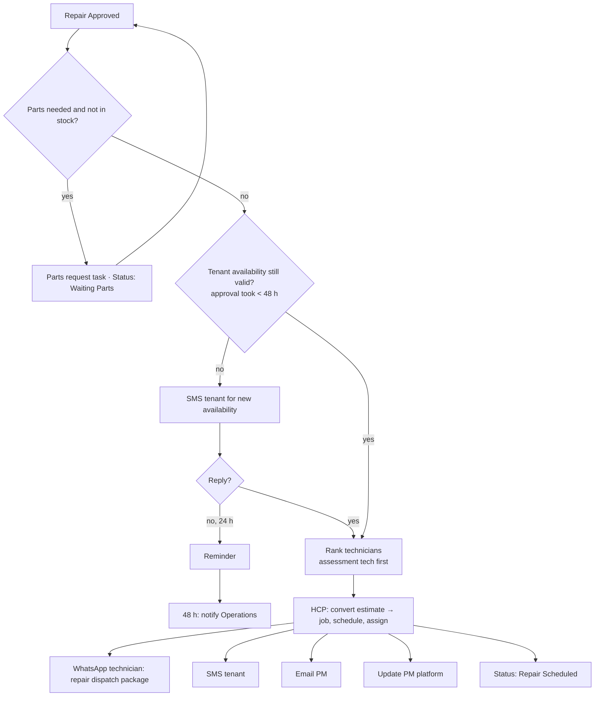

# Scenario 8 — Repair Scheduling & Dispatch

| | |
|---|---|
| **n8n workflow** | `Maintenance Ops · Work Order Lifecycle` → `pm_reply` approved output and the `tenant_signoff` callback output (`S08`) |
| **Trigger** | None of its own: continues from Scenario 7 (approved) or Scenario 9 (callback) |
| **Exit status** | `Repair Scheduled` (or `Waiting Parts`, `Waiting Tenant Response`) |
| **Systems** | Google Sheets, HCP, Twilio / WhatsApp, Gmail, PM platform |
| **Rules** | DIS-2, DIS-3, DIS-4, tenant follow-up timers |
| **Code** | `rank_technicians(..., preferred_technician=assessment_technician)` |

## Objective

Turn the approved estimate into a scheduled HCP job: confirm parts, reconfirm tenant availability, assign the technician (preferably the one who did the assessment), and notify everyone.

## Flow



## n8n nodes

| # | Node | Configuration |
|---|------|---------------|
| 1 | **IF** · parts needed? | Special-order parts in the assessment → **Google Sheets → Append Row** to `exceptions` (`Waiting Parts`) and stop; the Exception Monitor re-triggers when parts arrive. |
| 2 | **IF** · availability still valid? | Approval took > 48 h or no window left → **Twilio → Send SMS** asking for new availability; the reply comes back through `/events/sms`. |
| 3 | **Google Sheets → Get Row(s)** (`technicians`) + **Code** · rank technicians | `preferred_technician` = `assessment_technician`. |
| 4 | **HTTP Request** · HCP convert estimate to job + schedule | Attach the approved estimate; assign technician. |
| 5 | **WhatsApp → Send Message** | Repair dispatch package (no PM company, PM WO #, or money). |
| 6 | **Twilio → Send SMS** | Tenant appointment message. |
| 7 | **Gmail → Send** | PM notice. |
| 8 | PM platform update | API or Playwright sub-workflow. |
| 9 | **Google Sheets → Update Row** | `job_id`, `repair_technician`, `repair_scheduled_at`, status `Repair Scheduled`; append history. |

## Messages

**Tenant (if availability is needed)**

```text
Hi {{tenant_first_name}}, your repair has been approved! Please reply with a day and time window
that works for you, and any updated entry instructions.
```

**Tenant (scheduled)**

```text
Your repair is scheduled for {{date}}, {{window}}. Our technician will arrive during this window.
Reply to this message if you need to reschedule.
```

**Property manager**

```text
Repair for work order {{pm_work_order_number}} is scheduled for {{date}}, {{window}}.
```

## Test checklist

- [ ] The assessment technician is assigned when available; otherwise the next qualified one.
- [ ] Approval older than 48 h triggers a new availability request.
- [ ] HCP job created from the same estimate; `job_id` saved.
- [ ] Technician package has the approved scope and no prices or PM details.
- [ ] `Waiting Parts` work orders re-enter this scenario when parts arrive.
