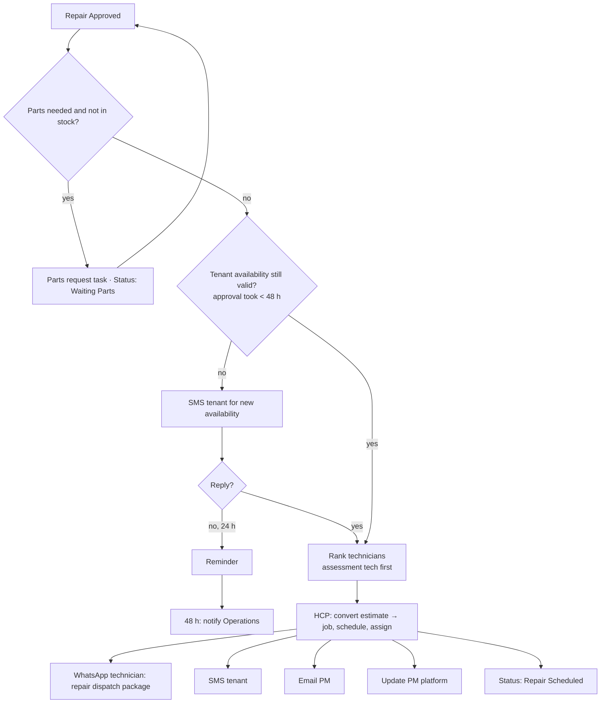

# Scenario 8 — Repair Scheduling & Dispatch

| | |
|---|---|
| **Make.com name** | `08 - Repair Scheduling Dispatch` |
| **Trigger** | Watch Rows, `status` = `Repair Approved` (also `Callback Required`) |
| **Exit status** | `Repair Scheduled` (or `Waiting Parts`, `Waiting Tenant Response`) |
| **Systems** | Google Sheets, HCP, Twilio / WhatsApp, Gmail, PM platform |
| **Rules** | DIS-2, DIS-3, DIS-4, tenant follow-up timers |
| **Code** | `rank_technicians(..., preferred_technician=assessment_technician)` |

## Objective

Turn the approved estimate into a scheduled HCP job: confirm parts, reconfirm tenant availability, assign the technician (preferably the one who did the assessment), and notify everyone.

## Flow



## Modules

| # | Module | Configuration |
|---|--------|---------------|
| 1 | Watch Rows + filter | `status` in `Repair Approved`, `Callback Required` |
| 2 | Router: parts | If the assessment lists special-order parts → create task, `Waiting Parts` |
| 3 | Router: availability | If `approval_received_at` − `assessment_submitted_at` > 48 h or no window left → SMS tenant |
| 4 | Sheets → Search Rows (`technicians`) | Same as Scenario 5; `assessment_technician` ranked first if eligible |
| 5 | HCP → Convert estimate to job; schedule; assign | Attach the approved estimate |
| 6 | WhatsApp → technician | Repair dispatch package (no PM company, PM WO #, or money) |
| 7 | Twilio → tenant | Template below |
| 8 | Gmail → PM | Template below |
| 9 | PM platform update | Appointment date/time and status |
| 10 | Sheets → Update | `job_id`, `repair_technician`, `repair_scheduled_at`, `status`; append `status_history` |

## Messages

**Tenant (if availability is needed)**

```text
Hi {{tenant_first_name}}, your repair has been approved! Please reply with a day and time window
that works for you, and any updated entry instructions.
```

**Tenant (scheduled)**

```text
Your repair is scheduled for {{date}}, {{window}}. Our technician will arrive during this window.
Reply to this message if you need to reschedule.
```

**Property manager**

```text
Repair for work order {{pm_work_order_number}} is scheduled for {{date}}, {{window}}.
```

## Test checklist

- [ ] The assessment technician is assigned when available; otherwise the next qualified one.
- [ ] Approval older than 48 h triggers a new availability request.
- [ ] HCP job created from the same estimate; `job_id` saved.
- [ ] Technician package has the approved scope and no prices or PM details.
- [ ] `Waiting Parts` work orders re-enter this scenario when parts arrive.
