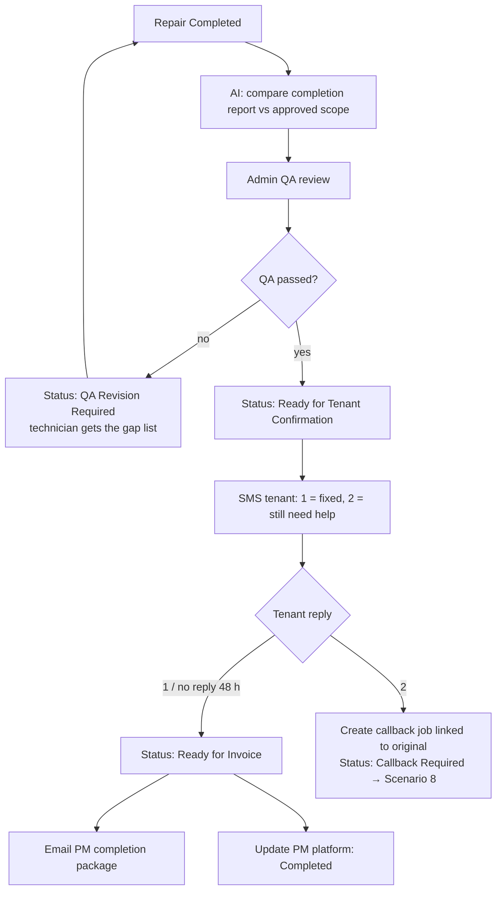

# Scenario 9 — Completion, QA & Tenant Sign-off

| | |
|---|---|
| **n8n workflow** | `Maintenance Ops · Work Order Lifecycle` → `job_completed` branch (QA) and `tenant_signoff` branch (sign-off) (`S09`) |
| **Trigger** | **Webhook** `POST /events/job_completed` (HCP job completed or the completion form); tenant replies via `/events/sms` |
| **Exit status** | `Ready for Invoice` or `Callback Required` |
| **Systems** | HCP, OpenAI / Claude, Google Sheets, Twilio, Gmail, PM platform |
| **Rules** | QA-1, QA-2, QA-3 |

## Objective

Verify the work matches the approved scope and is fully documented, confirm with the tenant, send the PM a completion package, and hand off to billing.

## Flow



## Completion report (technician)

Job #, estimate #, repair completed (itemized), final findings, materials used, labor hours (internal), before / during / after photos, remarks, optional tenant signature.

## n8n nodes

**`job_completed` branch**

| # | Node | Configuration |
|---|------|---------------|
| 1 | **Google Sheets → Get Row(s)** | Work order by `job_id` or `estimate_id`. |
| 2 | **OpenAI → Message a Model** | [`prompts/04-scope-validation.md`](../../prompts/04-scope-validation.md), JSON output. |
| 3 | **Slack → Send Message** + **Wait** · On Webhook Call | QA card with **Pass** / **Revise** links that resume the execution. |
| 4 | **IF** · passed? | False → **Gmail / WhatsApp** to the technician with `note_to_technician`; status `QA Revision Required`. |
| 5 | **Twilio → Send SMS** | Sign-off message below; status `Ready for Tenant Confirmation`. |

**`tenant_signoff` branch** (reached from `/events/sms` when the status is `Ready for Tenant Confirmation`)

| # | Node | Configuration |
|---|------|---------------|
| 1 | **Switch** · fixed / callback | Reply `1` → fixed. Reply `2` → callback. |
| 2 | fixed → **Google Sheets → Update Row** | `tenant_signoff` = Yes, status `Ready for Invoice` → continues into Scenario 10. |
| 3 | callback → **HTTP Request** · HCP create callback job (linked to the original) | Status `Callback Required` → continues into Scenario 8's ranking and dispatch. |
| — | No reply in 48 h | The Exception Monitor moves the work order to `Ready for Invoice` with the note "tenant did not respond". |

## Tenant sign-off message

```text
Hi {{tenant_first_name}}, our technician has completed your repair.
Before we close your work order, is everything working properly?
Reply 1 = Yes, it's fixed   ·   2 = I still need help
```

## Test checklist

- [ ] Missing after-photos → QA revision; technician receives the gap list.
- [ ] Same-visit repairs from Scenario 6 go through the same QA.
- [ ] Reply "2" creates a callback job linked to the original job #.
- [ ] PM completion package has no internal costs.
