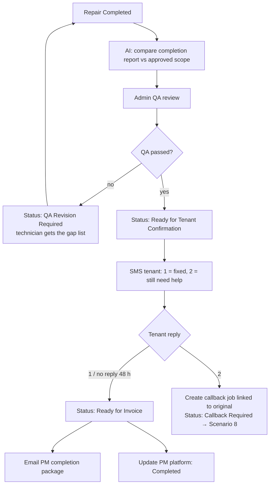

# Scenario 9 — Completion, QA & Tenant Sign-off

| | |
|---|---|
| **Make.com name** | `09 - Completion QA Signoff` |
| **Trigger** | Watch Rows, `status` = `Repair Completed` (from Scenario 6 same-visit or Scenario 8) |
| **Exit status** | `Ready for Invoice` or `Callback Required` |
| **Systems** | HCP, OpenAI / Claude, Google Sheets, Twilio, Gmail, PM platform |
| **Rules** | QA-1, QA-2, QA-3 |

## Objective

Verify the work matches the approved scope and is fully documented, confirm with the tenant, send the PM a completion package, and hand off to billing.

## Flow



## Completion report (technician)

Job #, estimate #, repair completed (itemized), final findings, materials used, labor hours (internal), before / during / after photos, remarks, optional tenant signature.

## Modules

| # | Module | Configuration |
|---|--------|---------------|
| 1 | Watch Rows + filter | `status` = `Repair Completed` |
| 2 | AI → Create a Completion | [`prompts/04-scope-validation.md`](../../prompts/04-scope-validation.md) |
| 3 | Slack / Gmail → QA card | AI result + photos; **Pass** / **Revise** buttons (webhooks) |
| 4 | Router | Pass → tenant SMS. Revise → message technician with `note_to_technician`. |
| 5 | Twilio → tenant | Sign-off message below; record reply via webhook |
| 6 | Router: tenant reply | 1 → `Ready for Invoice`. 2 → callback job. No reply in 48 h → `Ready for Invoice` with note "tenant did not respond". |
| 7 | Gmail → PM completion package | PM WO #, estimate #, job #, completion summary, final scope, before/after photos, completion date |
| 8 | PM platform update | Status Completed, completion date, notes, photos |
| 9 | Sheets → Update | `qa_status`, `tenant_signoff`, `callback_required`, `status`; append history |

## Tenant sign-off message

```text
Hi {{tenant_first_name}}, our technician has completed your repair.
Before we close your work order, is everything working properly?
Reply 1 = Yes, it's fixed   ·   2 = I still need help
```

## Test checklist

- [ ] Missing after-photos → QA revision; technician receives the gap list.
- [ ] Same-visit repairs from Scenario 6 go through the same QA.
- [ ] Reply "2" creates a callback job linked to the original job #.
- [ ] PM completion package has no internal costs.
