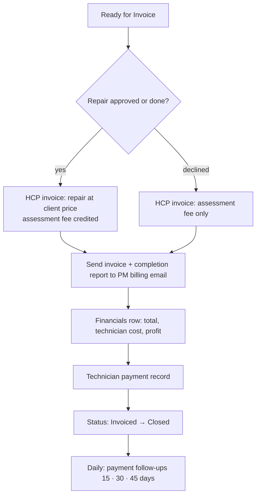

# Scenario 10 — Billing, Technician Pay & Reconciliation

| | |
|---|---|
| **n8n workflow** | `Maintenance Ops · Work Order Lifecycle` → `tenant_signoff` fixed output and the `pm_reply` declined output (`S10`) |
| **Trigger** | None of its own: continues from Scenario 9 (fixed) or Scenario 7 (declined). Payment follow-ups run in the Exception Monitor. |
| **Exit status** | `Invoiced` → `Closed` (payment tracked separately in `financials.payment_status`) |
| **Systems** | HCP invoices, Google Sheets, Gmail |
| **Rules** | FEE-1, FEE-2, payment follow-up timers |
| **Code** | `maintenance_ops.billing` |
| **Decision record** | [ADR-002](../decisions/ADR-002-assessment-fee-credit.md) |

## Objective

Invoice the PM correctly, record technician pay and profit, and chase unpaid invoices on a schedule. Client billing and internal financials stay separate.

## Flow

## Invoice examples

| | Approved repair (`waive`, default) | Approved repair (`deduct`) | Declined estimate |
|---|---|---|---|
| Plumbing repair | $325.00 | $325.00 | — |
| Assessment fee | $0.00 (credited, not billed) | −$75.00 (already paid) | $75.00 |
| **Amount due** | **$325.00** | **$250.00** | **$75.00** |

Internal record for the default case: client $325 − internal cost $240 = **gross profit $85 (26.2%)**.

## n8n nodes

| # | Node | Configuration |
|---|------|---------------|
| 1 | **IF** · approved repair? | Approved / same-visit vs. declined. |
| 2 | **HTTP Request** · HCP create invoice | From the job (or the estimate when declined). Title includes PM WO #; lines per the table above. |
| 3 | **Gmail → Send** · PM completion package | To `billing_email`: invoice PDF, completion report, photos, PM WO # in the subject. |
| 4 | **HTTP Request** · `POST {{RULES_ENGINE_URL}}/decide` (optional) or **Code** | Profit = invoice total − internal cost; margin %. |
| 5 | **Google Sheets → Append Row** (`financials`) | `invoice_total`, `assessment_credit_applied`, `technician_cost`, `gross_profit`, `gross_margin_pct`, `payment_status` = Sent. |
| 6 | **Google Sheets → Update Row** (`work_orders`) | `invoice_id`, status `Invoiced`, then `Closed`, `closed_at`. |
| 7 | **Slack → Send Message** | Accounting: "New invoice {{invoice_id}} · {{pm_company_name}} · ${{invoice_total}}". |
| 8 | Payment follow-ups | Exception Monitor (daily part): 15 d reminder, 30 d escalate, 45 d collections review. HCP "invoice paid" webhook → `/events/invoice_paid` → **Google Sheets → Update Row** `payment_status` = Paid. |

## Test checklist

- [ ] Approved $325 repair invoices $325 with the fee shown as credited.
- [ ] Declined estimate invoices $75 only.
- [ ] Financials row shows profit $85 and margin 26.2%.
- [ ] Invoice email contains no internal costs.
- [ ] Payment reminders fire at 15, 30, and 45 days and stop once paid.
