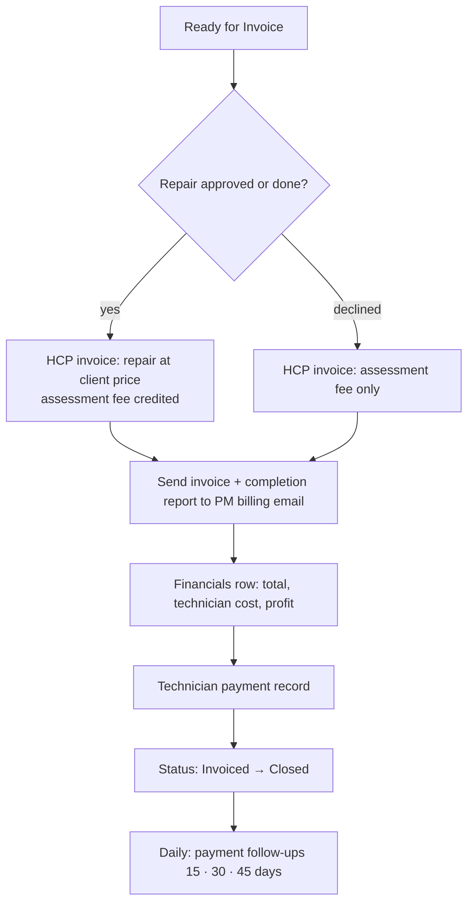

# Scenario 10 — Billing, Technician Pay & Reconciliation

| | |
|---|---|
| **Make.com name** | `10 - Billing Reconciliation` |
| **Trigger** | Watch Rows, `status` = `Ready for Invoice` |
| **Exit status** | `Invoiced` → `Closed` (payment tracked separately in `financials.payment_status`) |
| **Systems** | HCP invoices, Google Sheets, Gmail |
| **Rules** | FEE-1, FEE-2, payment follow-up timers |
| **Code** | `maintenance_ops.billing` |
| **Decision record** | [ADR-002](../decisions/ADR-002-assessment-fee-credit.md) |

## Objective

Invoice the PM correctly, record technician pay and profit, and chase unpaid invoices on a schedule. Client billing and internal financials stay separate.

## Flow

## Invoice examples

| | Approved repair (`waive`, default) | Approved repair (`deduct`) | Declined estimate |
|---|---|---|---|
| Plumbing repair | $325.00 | $325.00 | — |
| Assessment fee | $0.00 (credited, not billed) | −$75.00 (already paid) | $75.00 |
| **Amount due** | **$325.00** | **$250.00** | **$75.00** |

Internal record for the default case: client $325 − internal cost $240 = **gross profit $85 (26.2%)**.

## Modules

| # | Module | Configuration |
|---|--------|---------------|
| 1 | Watch Rows + filter | `status` = `Ready for Invoice` |
| 2 | Router | Approved / same-visit vs. declined |
| 3 | HCP → Create invoice from job (or estimate for declined) | Title includes PM WO #; lines per table above |
| 4 | Gmail → PM `billing_email` | Invoice PDF, completion report, photos, PM WO # in subject |
| 5 | Sheets → Add a Row (`financials`) | `invoice_total`, `assessment_credit_applied`, `technician_cost`, `gross_profit`, `gross_margin_pct`, `payment_status` = Sent |
| 6 | Sheets → Update work order | `invoice_id`, `status` = `Invoiced`, then `Closed`, `closed_at` |
| 7 | Gmail / Slack → Accounting | "New invoice {{invoice_id}} · {{pm_company_name}} · ${{invoice_total}}" |
| 8 | **Scheduled scenario `10b`** (daily 8 AM) | For unpaid invoices: `payment_follow_up(sent_on, today)` → 15 d reminder to PM, 30 d escalate to Accounting, 45 d flag Collections Review |
| 9 | HCP webhook "invoice paid" | `payment_status` = Paid, `paid_at` |

## Test checklist

- [ ] Approved $325 repair invoices $325 with the fee shown as credited.
- [ ] Declined estimate invoices $75 only.
- [ ] Financials row shows profit $85 and margin 26.2%.
- [ ] Invoice email contains no internal costs.
- [ ] Payment reminders fire at 15, 30, and 45 days and stop once paid.
