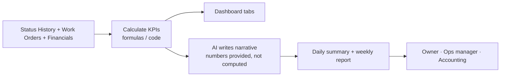

# Scenario 11 — KPI Dashboard & Management Reporting

| | |
|---|---|
| **n8n workflow** | `Maintenance Ops · KPI Report` (separate workflow) |
| **Trigger** | **Schedule Trigger**: daily 6:00 AM and Monday 7:00 AM |
| **Systems** | Google Sheets (formulas / pivots, Looker Studio optional), OpenAI / Claude, Gmail / Slack / Teams |
| **Code** | `maintenance_ops.kpis` |

## Objective

Turn the operations data into a dashboard and short reports that show workload, speed, quality, money, and which PM companies and technicians need attention.

## Flow



## KPIs

| Area | KPI | Definition |
|------|-----|------------|
| Volume | Work orders received / open / completed / cancelled / emergency | Counts by status |
| Speed | Response time | `first_tenant_contact_at − received_at` |
| Speed | Approval time | `approval_received_at − approval_requested_at` |
| Speed | Completion time | `repair_completed_at − received_at` |
| Quality | First-visit resolution | Repairs completed on the assessment visit ÷ completed repairs |
| Quality | Callback rate | Callback jobs ÷ completed repairs |
| Quality | QA pass rate | QA passed first time ÷ QA reviews |
| Money | Revenue, gross profit, margin | From `financials` |
| Money | Outstanding invoices by age | 0–15, 16–30, 31–45, 45+ days |
| PM companies | Jobs, revenue, average price, approval time, days to pay | Grouped by `pm_company_id` |
| Technicians | Jobs, FVR, callbacks, QA pass, rating | Grouped by technician |

Time-based KPIs read **Status History**, so they survive later edits to the work order row.

## n8n nodes

| # | Node | Configuration |
|---|------|---------------|
| 1 | **Schedule Trigger** | Two rules: daily 06:00, weekly Monday 07:00. |
| 2 | **Google Sheets → Get Row(s)** ×3 | `work_orders`, `status_history`, `financials`. |
| 3 | **Code** · calculate KPIs | Port of `maintenance_ops.kpis` (or rely on formula tabs in the sheet). |
| 4 | **Google Sheets → Update Row** | Dashboard tabs. |
| 5 | **AI Agent** · Report Agent | [`prompts/06-weekly-management-report.md`](../../prompts/06-weekly-management-report.md) with this week vs last week. |
| 6 | **Gmail → Send** / **Slack → Send Message** | Daily summary to Ops; weekly report to Owner, Ops, Accounting. |

## Example weekly report

```text
Weekly Maintenance Operations Report · July 1–7

Highlights
• 86 work orders completed (+9%)
• 72% resolved on the first visit
• Average tenant response time: 18 minutes

Issues
• ABC Property Management approval time rose 35% (31 h → 42 h).
  → Send approval requests before noon and add their secondary contact to the 24 h reminder.
• Technician callback rate for plumbing rose from 2% to 6%.
  → Review last week's supply-line repairs; schedule a ride-along.
```

## Test checklist

- [ ] KPIs match a manual calculation on the sample data (`tests/test_kpis_and_extraction.py`).
- [ ] The AI report only uses numbers present in the input.
- [ ] Reports reach the right recipients and contain no tenant personal data.
