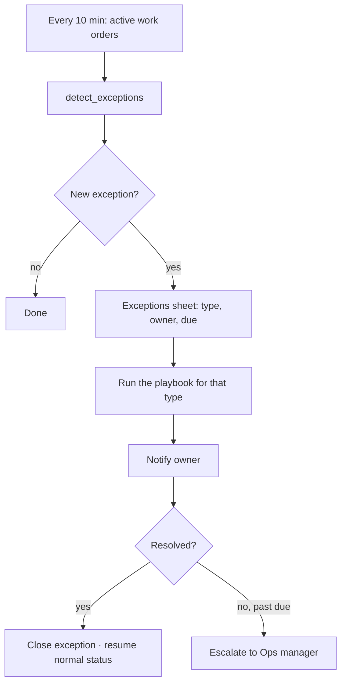

# Scenario 12 — Exception Handling & Escalation

| | |
|---|---|
| **n8n workflow** | `Maintenance Ops · Exception Monitor` (separate workflow) |
| **Trigger** | **Schedule Trigger** every 10 minutes (timers) and daily 8:00 AM (payments) |
| **Systems** | Google Sheets, Twilio, Gmail / Slack, HCP |
| **Code** | `maintenance_ops.followups.detect_exceptions` |

## Objective

Catch work orders that are stuck, failed, or unusual, give each one an **owner, a next action, and a deadline**, and bring it back into the normal flow.

## Flow



## n8n nodes

| # | Node | Configuration |
|---|------|---------------|
| 1 | **Schedule Trigger** | Every 10 min; second rule daily 08:00 for payment follow-ups. |
| 2 | **Google Sheets → Get Row(s)** | Active work orders (status not Closed / Cancelled), plus open `exceptions` and the last follow-up step per work order from `communication_log`. |
| 3 | **Code** · SLA + timer check | Port of `maintenance_ops.followups.detect_exceptions` and the follow-up step functions. Emits one item per due action. |
| 4 | **Switch** · action type | tenant reminder · PM reminder · escalation · payment reminder · parts check. |
| 5 | **Twilio / Gmail / Slack** | The message for that action. |
| 6 | **Google Sheets → Append Row** | `exceptions` (new) and `communication_log` (so each step is sent once); **Update Row** for status changes such as `Approval Delayed`. |

## Playbooks

| # | Exception | Detection | Automatic actions | Hold status | Owner |
|---|-----------|-----------|-------------------|-------------|-------|
| 1 | Tenant not responding | No reply 24 h after contact | 24 h reminder SMS; 48 h notify admin + PM | Waiting Tenant Response | Dispatcher |
| 2 | Access failed | Technician reports no access (no one home, wrong code, refused, pet safety) with arrival/departure time and photo | Notify admin + tenant, request new availability, reschedule | Access Failed | Dispatcher |
| 3 | Repair can't be completed | Technician marks incomplete: more damage, wrong parts, safety concern | Needs approval → back to Scenario 6 pricing; needs parts → #4 | — | Operations |
| 4 | Parts required | Parts not in stock | Parts request task (job #, parts, supplier, ETA); notify technician, dispatcher, admin | Waiting Parts | Operations |
| 5 | PM approval delay | Timers in Scenario 7 | 20 min follow-up, 24 h reminder, 48 h escalation | Approval Delayed | Operations |
| 6 | Estimate declined | PM declines | Assessment-only invoice, notify accounting, close | Estimate Declined | Accounting |
| 7 | Emergency | Priority = Emergency at intake or from tenant chat | Create emergency job, alert on-call dispatcher, assign emergency technician, notify tenant and PM; track received → assigned → arrived → completed | — | Dispatcher |
| 8 | Failed QA / callback | QA revise or tenant reply "2" | Reopen job, create linked callback, assign technician; track original job #, reason, warranty status | Callback Required | Operations |
| 9 | SLA breach | Tenant contact > 15 min, estimate > 30 min, scheduling > 24 h | Flag and notify | — | Per stage |
| 10 | Approved repair unassigned | `Repair Approved` with no technician | Notify dispatcher immediately | — | Dispatcher |

## Messages

**Tenant: no response**

```text
Hi {{tenant_first_name}}, we're following up on your maintenance request at {{property_address}}.
Please reply with a day and time that works so we can schedule your service.
```

**Tenant: access failed**

```text
We weren't able to access your home today. Please reply with a new day and time so we can reschedule.
```

## Exceptions sheet

| Column | Example |
|--------|---------|
| `record_id` | MO-2026-0001 |
| `type` | Access failed |
| `detected_at` | 2026-07-20 10:15 |
| `owner` | Dispatcher |
| `status` | Open |
| `next_action` | Get new availability |
| `due_at` | 2026-07-20 14:00 |
| `resolution` | Rescheduled to Jul 22 |

## Test checklist

- [ ] Each playbook creates exactly one open exception (no duplicates on the next 10-minute run).
- [ ] Resolving the underlying status closes the exception.
- [ ] Emergencies alert within one minute (pushed at intake, not waiting for the 10-minute run).
- [ ] `tests/test_followups.py` passes.
