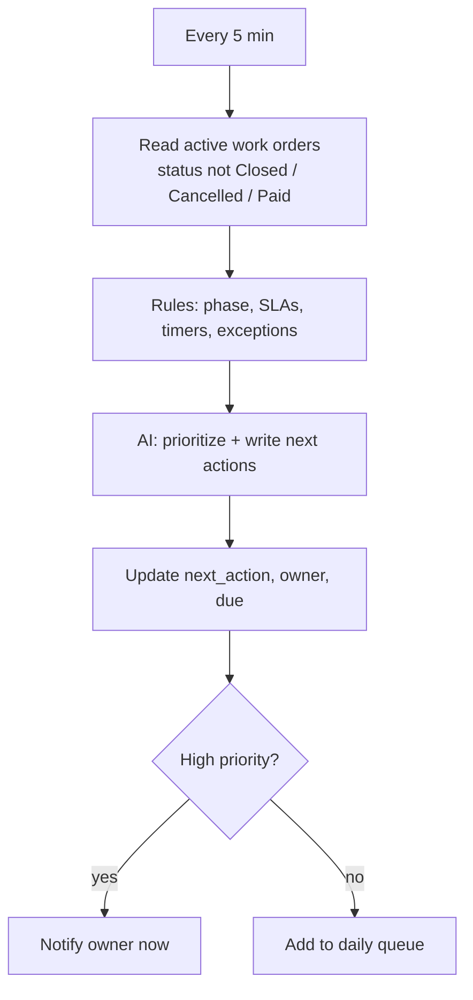

# Scenario 13 — AI Operations Coordinator

| | |
|---|---|
| **n8n workflow** | `Maintenance Ops · Coordinator` (separate workflow) |
| **Trigger** | **Schedule Trigger** (every 5 min, 7:00 AM queue, 6:00 PM summary) and **Slack Trigger** (staff questions) |
| **Systems** | Google Sheets, OpenAI / Claude, Slack / Teams / GHL, Gmail |
| **Code** | `maintenance_ops.followups` (rules first), prompt [`05-operations-coordinator.md`](../../prompts/05-operations-coordinator.md) |

## Objective

Act as a virtual operations manager: watch every active work order, keep `next_action` / `owner` / `due` current, surface bottlenecks, and answer staff questions from live data. It orchestrates the other scenarios; it doesn't replace them.

## Flow

## n8n nodes

| # | Node | Configuration |
|---|------|---------------|
| 1 | **Schedule Trigger** | Every 5 min; 07:00 queue; 18:00 summary. |
| 2 | **Google Sheets → Get Row(s)** + **Code** | Active work orders and the rules engine's exceptions. |
| 3 | **AI Agent** · Coordinator | Prompt [`prompts/05-operations-coordinator.md`](../../prompts/05-operations-coordinator.md); **Google Sheets Tool** (read-only) so it can look things up; **Structured Output Parser** for the action list. |
| 4 | **Google Sheets → Update Row** | `next_action`, `next_action_owner`, `next_action_due`. |
| 5 | **Slack → Send Message** | High-priority items now; queue and summary on schedule. |
| 6 | **Slack Trigger** → same AI Agent | Staff questions in `#maintenance-ops`, answered from live sheet data. |

## Capabilities

| Capability | How |
|-----------|-----|
| Next action per work order | Rules decide what is overdue; AI writes the action and reason |
| SLA monitoring | Targets from `config/business_rules.yaml` |
| Daily priority queue (7 AM) | High: emergencies, approvals > 48 h, callbacks today. Medium: waiting on tenant or parts. Low: invoice follow-ups, warranty expirations. |
| Staff chat | "Which jobs need dispatch today?" "What's waiting on PM approval?" "Which invoices are overdue?" The AI answers from a filtered Sheets query, never from memory. |
| Recommendations | e.g. "ABC averages 72 h approvals; send their estimates before noon." |
| Daily summary (6 PM) | Received, completed, pending approval, emergencies, revenue, outstanding, response time, FVR, callback rate, alerts |
| Pattern log | Repeat issues at the same property, frequently replaced parts, seasonal trends, slow-paying clients |

## Guardrails

- The coordinator **recommends and notifies**. It does not approve estimates, change prices, or close work orders.
- Every AI statement must cite a work order and a field value; the prompt forbids inventing facts.
- Tenant personal data stays out of Slack summaries (use record ID and address only).

## Test checklist

- [ ] An approved repair with no technician appears as high priority within 5 minutes.
- [ ] A chat question returns the same list as a manual filter on the sheet.
- [ ] Daily summary numbers match Scenario 11.
