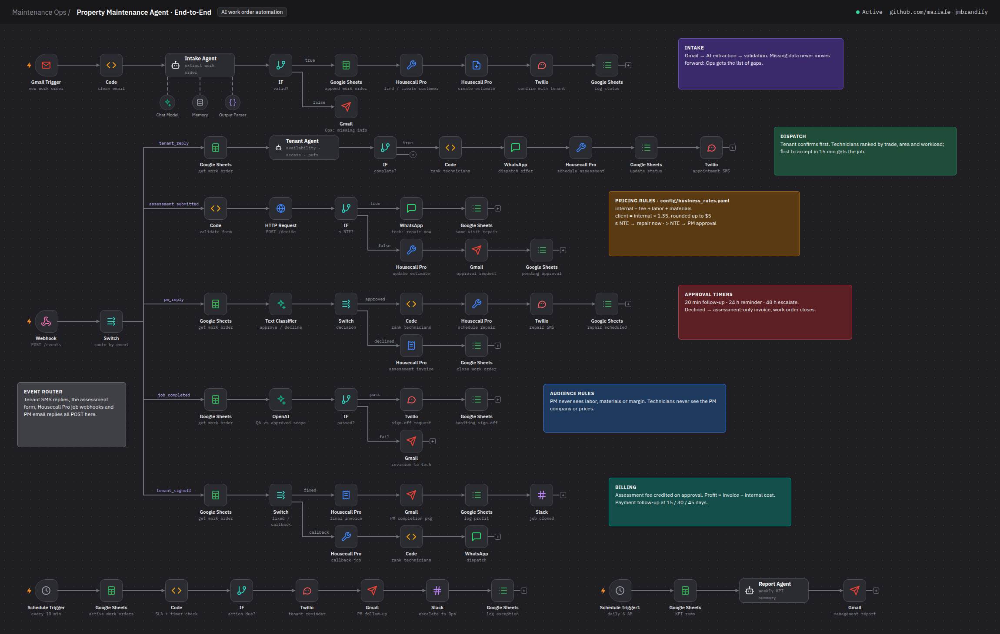

# n8n Workflows

The whole system runs as **five n8n workflows** plus a shared error handler. Export each one to `n8n/workflows/` once it is built and passes its scenario test checklists.

| File | Workflow name in n8n | Triggers | Scenarios |
|------|---------------------|----------|-----------|
| `workflows/main-work-order-lifecycle.json` | `Maintenance Ops · Work Order Lifecycle` | Gmail Trigger (new work orders), Webhook `POST /events/:event`, Gmail Trigger (approval replies) | 1–10 |
| `workflows/exception-monitor.json` | `Maintenance Ops · Exception Monitor` | Schedule Trigger (every 10 min, daily 08:00) | 12 + follow-up timers for 7, 9, 10 |
| `workflows/kpi-report.json` | `Maintenance Ops · KPI Report` | Schedule Trigger (daily 06:00, Monday 07:00) | 11 |
| `workflows/ops-coordinator.json` | `Maintenance Ops · Coordinator` | Schedule Trigger, Slack Trigger | 13 |
| `workflows/sop-assistant.json` | `Maintenance Ops · SOP Assistant` | Chat Trigger | 14 |
| `workflows/error-handler.json` | `Maintenance Ops · Error Handler` | Error Trigger | All (set as each workflow's Error Workflow) |

## Conventions

- **Node names** start with the scenario they implement: `S06 · HTTP /decide`, `S07 · Text Classifier`. Searching the canvas for `S06` shows one scenario.
- **Sticky notes** label each branch with its scenario and the business rule it enforces.
- **Status strings** written to Google Sheets come only from [`config/status_lifecycle.yaml`](../config/status_lifecycle.yaml).
- **Rules** (pricing, NTE, follow-up timers) come from the rules engine over HTTP, or from Code nodes kept in sync with [`config/business_rules.yaml`](../config/business_rules.yaml).
- **Errors**: external-API nodes use *On Error → Continue (using error output)* into an Exceptions-sheet logger; every workflow sets `Maintenance Ops · Error Handler` as its Error Workflow.

## Credentials to create in n8n

| Credential | Used by |
|-----------|---------|
| Gmail OAuth2 | Gmail Trigger, Gmail |
| Google Sheets OAuth2 | Google Sheets |
| Google Drive OAuth2 | photo uploads |
| OpenAI API (or Anthropic API) | AI Agent chat models, Text Classifier, OpenAI node |
| Header Auth · Housecall Pro (`Authorization: Token …`) | HTTP Request nodes to the Housecall Pro API |
| Twilio API | Twilio |
| WhatsApp Business Cloud | WhatsApp |
| Slack OAuth2 | Slack, Slack Trigger |
| Header Auth · rules engine (`X-API-Key`) | HTTP Request to `/decide`, `/extraction` |

## Webhook events

Point each sender at `https://<your-n8n>/webhook/events/<event>`:

| Event | Sender |
|-------|--------|
| `sms` | Twilio phone number → Messaging webhook |
| `dispatch_reply` | WhatsApp Business webhook (button replies) |
| `assessment_submitted` | Technician assessment form |
| `pm_reply` | Housecall Pro webhook: estimate approved / declined |
| `job_completed` | Housecall Pro webhook: job completed |
| `invoice_paid` | Housecall Pro webhook: invoice paid |

## Exporting

1. In n8n: **⋯ → Download** on the workflow.
2. Before committing, remove credential IDs, webhook IDs, spreadsheet IDs, emails and phone numbers; replace them with placeholders such as `{{GOOGLE_SHEETS_SPREADSHEET_ID}}`.
3. Commit with the workflow in the message: `feat(n8n): main lifecycle – S06 budget decision branch`.

## Importing

**Workflows → Import from File**, then open each node with a red warning and pick your own credential. Replace the placeholders using [`.env.example`](../.env.example) as the checklist, then activate the error handler first and the main workflow last.
